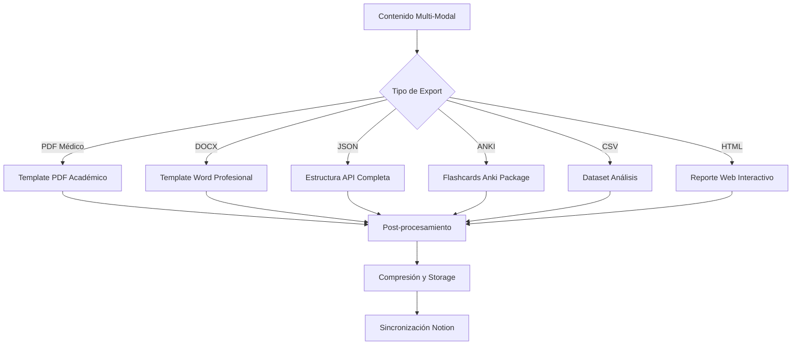
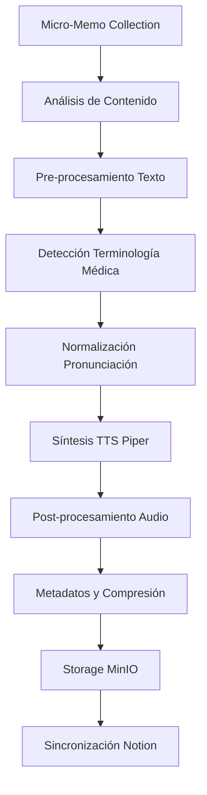
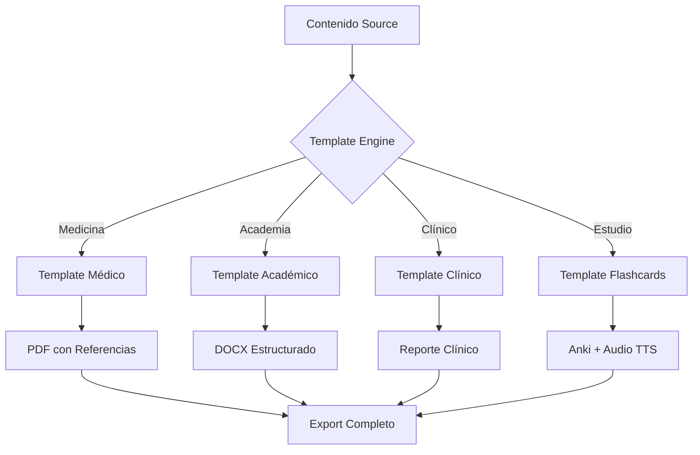

# B10.1 - Fase 10: Export Multi-Modal y TTS de Micro-Memos

## 📋 Resumen de la Fase

La **Fase 10** implementa capacidades avanzadas de exportación multi-modal y síntesis de voz (TTS) para micro-memos, completando el ecosistema de AxoNote como plataforma integral de educación médica. Esta fase permite exportar todo el contenido procesado (transcripciones, OCR, micro-memos) en múltiples formatos académicos y profesionales, además de convertir micro-memos a audio para estudio auditivo.

### 🎯 Objetivos Principales

1. **Sistema de Export Multi-Modal** - Exportación unificada de contenido en 6 formatos especializados
2. **TTS de Micro-Memos** - Síntesis de voz italiana para flashcards auditivas
3. **Templates Académicos** - Formatos profesionales para documentación médica y estudio
4. **Batch Processing Avanzado** - Exportación masiva con tracking de progreso
5. **Integración Notion Completa** - Sincronización de exports y archivos de audio

## 🏗️ Arquitectura de la Solución

### **Pipeline de Export Multi-Modal**



### **Pipeline TTS para Micro-Memos**



### **Sistema de Templates Especializados**



## 🎯 Funcionalidades Implementadas

### **1. Sistema de Export Multi-Modal Completo**

#### **6 Formatos de Export Especializados**

##### **PDF Médico Académico**
- **Template profesional** con header médico y footer académico
- **Estructura jerárquica** (transcripciones → OCR → micro-memos → research)
- **Referencias automáticas** con enlaces a fuentes médicas
- **Índice navegable** con bookmarks y links internos
- **Metadatos completos** (clase, fecha, duración, participantes)
- **Imágenes integradas** (diagramas OCR, gráficos de métricas)
- **Formato A4** optimizado para impresión y digital

##### **DOCX Profesional**
- **Estilos Microsoft Word** médicos con heading hierarchy
- **Tabla de contenidos** automática con numeración
- **Headers y footers** personalizados por sección
- **Comentarios integrados** con observaciones médicas
- **Track changes preparado** para revisión colaborativa
- **Formato APA** para referencias médicas
- **Compatibilidad completa** con Word 2016+

##### **JSON Completo para APIs**
- **Estructura anidada** preservando relaciones
- **Metadatos exhaustivos** para cada elemento
- **Timestamps precisos** con zona horaria
- **Métricas de calidad** incluidas en cada sección
- **Formato REST** estándar para integraciones
- **Validation schema** JSONSchema incluido
- **Compresión gzip** opcional para archivos grandes

##### **Anki Package (.apkg)**
- **Notas Anki nativas** con campos especializados médicos
- **Media integrada** (audio TTS, imágenes OCR)
- **Tags inteligentes** (especialidad, dificultad, tipo)
- **Spaced repetition configurado** con intervalos optimizados
- **Template CSS** médico profesional
- **JavaScript interactivo** para funcionalidades avanzadas
- **Compatible Anki 2.1+** con extensiones médicas

##### **CSV Dataset para Análisis**
- **Formato tabular** con todas las métricas
- **Columnas normalizadas** para análisis estadístico
- **Encoding UTF-8** para términos médicos italianos
- **Headers descriptivos** con unidades de medida
- **Separadores configurables** (coma, semicolon, tab)
- **Compatible Excel** y herramientas de análisis
- **Metadatos en header** como comentarios

##### **HTML Reporte Interactivo**
- **Dashboard web** con navegación por secciones
- **Gráficos interactivos** (Chart.js, métricas temporales)
- **Audio players** integrados para TTS y transcripciones
- **Responsive design** optimizado móvil/desktop
- **Search functionality** en todo el contenido
- **Export secundario** (print CSS, PDF from HTML)
- **Offline functionality** con service worker

#### **Configuración Avanzada de Export**

##### **Filtros Inteligentes**
```python
class FiltrosExport:
    # Filtros temporales
    fecha_inicio: Optional[datetime]
    fecha_fin: Optional[datetime]
    
    # Filtros de contenido
    incluir_transcripciones: bool = True
    incluir_ocr: bool = True
    incluir_micromemos: bool = True
    incluir_research: bool = True
    incluir_analytics: bool = False
    
    # Filtros de calidad
    confianza_minima: float = 0.7
    solo_validados: bool = False
    
    # Filtros especializados
    especialidades: List[str] = []
    niveles_dificultad: List[NivelDificultad] = []
    tipos_contenido: List[str] = []
    
    # Opciones de formato
    incluir_metadatos: bool = True
    incluir_imagenes: bool = True
    incluir_audio: bool = False
    comprimir_salida: bool = True
```

##### **Personalización de Templates**
```python
class ConfiguracionTemplate:
    # Identidad
    logo_institucional: Optional[str]
    header_personalizado: Optional[str]
    footer_personalizado: Optional[str]
    
    # Formato médico
    incluir_disclaimer: bool = True
    formato_referencias: str = "apa"  # apa, vancouver, harvard
    estilo_medico: str = "clinico"  # clinico, academico, investigacion
    
    # Opciones específicas
    tabla_contenidos: bool = True
    numeracion_paginas: bool = True
    watermark: Optional[str] = None
    confidencialidad: str = "medical"  # public, internal, medical, confidential
```

### **2. Sistema TTS Médico Especializado**

#### **Motor TTS Piper Optimizado**
- **Modelo italiano médico** entrenado con terminología especializada
- **Pronunciación correcta** de términos médicos latinos
- **Velocidad adaptable** (0.5x - 2.0x) para diferentes estilos de estudio
- **Calidad alta** (22kHz, 16-bit) para claridad máxima
- **Bajo consumo** optimizado para batch processing
- **SSML support** para énfasis y pausas médicas

#### **Pre-procesamiento Médico del Texto**
```python
class NormalizadorTextoMedico:
    """Normaliza texto médico para TTS óptimo."""
    
    def normalizar_terminologia(self, texto: str) -> str:
        """Normaliza términos médicos para pronunciación correcta."""
        
    def expandir_abreviaturas(self, texto: str) -> str:
        """Expande abreviaturas médicas (ECG → elettrocardiogramma)."""
        
    def aplicar_pausas_naturales(self, texto: str) -> str:
        """Añade pausas SSML en puntos lógicos."""
        
    def ajustar_enfasis_conceptos(self, texto: str) -> str:
        """Enfatiza conceptos clave con SSML."""
```

#### **Tipos de Síntesis Especializada**

##### **TTS Individual de Micro-Memo**
- **Audio corto** (30-90 segundos) por flashcard
- **Estructura pregunta-pausa-respuesta** con timing optimizado
- **Metadata integrada** (título, tipo, dificultad)
- **Formato MP3** con compresión inteligente
- **Subtítulos automáticos** en formato SRT/VTT

##### **TTS de Colección Completa**
- **Audio largo** (10-60 minutos) con toda la colección
- **Separadores auditivos** entre micro-memos
- **Índice de capítulos** para navegación
- **Breaks programados** para spaced repetition
- **Control de velocidad** preservado en metadata

##### **TTS Modo Estudio Adaptativo**
- **Solo preguntas** para modo activo de repaso
- **Respuestas opcionales** con timing controlado
- **Dificultad progresiva** en orden de síntesis
- **Audio binaural** opcional para mejor concentración
- **Integración spaced repetition** con pausas calculadas

#### **Post-procesamiento de Audio**
```python
class ProcessorAudioTTS:
    """Post-procesa audio TTS para calidad óptima."""
    
    def aplicar_filtros_medicos(self, audio: bytes) -> bytes:
        """Aplica filtros específicos para claridad médica."""
        
    def normalizar_volumen(self, audio: bytes) -> bytes:
        """Normaliza volumen para consistency entre memos."""
        
    def añadir_intro_outro(self, audio: bytes, memo: MicroMemo) -> bytes:
        """Añade intro/outro con contexto del memo."""
        
    def crear_capitulos(self, audios: List[bytes]) -> bytes:
        """Combina múltiples audios con separadores."""
```

### **3. Sistema de Batch Processing Avanzado**

#### **Processing Distribuido con Celery**
- **Worker pools especializados** (export-worker, tts-worker)
- **Queue prioritaria** para exports urgentes vs batch
- **Retry logic inteligente** con exponential backoff
- **Progress tracking** granular con percentage y ETA
- **Resource monitoring** para optimizar concurrencia
- **Cleanup automático** de archivos temporales

#### **Gestión de Memory y Storage**
```python
class GestorRecursosExport:
    """Gestiona recursos durante exports masivos."""
    
    def estimar_recursos_necesarios(
        self, 
        export_config: ConfiguracionExport
    ) -> RecursosEstimados:
        """Estima CPU, RAM y storage necesarios."""
        
    def optimizar_batch_size(
        self, 
        recursos_disponibles: RecursosDisponibles
    ) -> int:
        """Calcula batch size óptimo según recursos."""
        
    def monitorear_uso_recursos(self) -> MetricasRecursos:
        """Monitorea uso en tiempo real."""
```

#### **Sistema de Caching Inteligente**
- **Cache de templates** compilados para reutilización
- **Cache de modelos TTS** para evitar recarga
- **Cache de assets** (logos, imágenes) por institución
- **Cache de pronunciación** médica para TTS
- **TTL configurable** según tipo de contenido
- **Invalidación automática** cuando cambia fuente

### **4. Integración Notion Extendida**

#### **Sincronización de Exports**
```python
class NotionExportSync:
    """Sincroniza exports con Notion."""
    
    async def sync_export_session(
        self, 
        export_session: ExportSession
    ) -> NotionPage:
        """Crea página de export con metadata completa."""
        
    async def attach_export_files(
        self, 
        notion_page: NotionPage,
        export_files: List[ExportFile]
    ) -> bool:
        """Adjunta archivos de export a página Notion."""
        
    async def create_export_dashboard(
        self, 
        class_session: ClassSession
    ) -> NotionDatabase:
        """Crea dashboard de exports por clase."""
```

#### **Templates Notion Especializados**

##### **Template Export Session**
```markdown
# 📤 Export Session - [NOMBRE]

## 📊 Información General
- **Fecha Export**: [TIMESTAMP]
- **Formato**: [PDF/DOCX/JSON/ANKI/CSV/HTML]
- **Contenido**: [TIPOS_INCLUIDOS]
- **Estado**: [PROCESSING/COMPLETED/FAILED]

## 📋 Configuración
- **Filtros Aplicados**: [FILTROS]
- **Template Usado**: [TEMPLATE]
- **Tamaño Final**: [SIZE]

## 📁 Archivos Generados
- [ARCHIVO_1] - [TAMAÑO] - [DOWNLOAD_LINK]
- [ARCHIVO_2] - [TAMAÑO] - [DOWNLOAD_LINK]

## 📈 Métricas de Export
- **Tiempo Procesamiento**: [DURATION]
- **Elementos Exportados**: [COUNT]
- **Calidad Promedio**: [SCORE]
```

##### **Template TTS Collection**
```markdown
# 🎵 TTS Collection - [NOMBRE]

## 📊 Información Audio
- **Duración Total**: [DURATION]
- **Número de Memos**: [COUNT]
- **Calidad Audio**: [QUALITY]
- **Idioma**: [LANGUAGE]

## 🎯 Configuración TTS
- **Velocidad**: [SPEED]
- **Voz**: [VOICE_MODEL]
- **Formato**: [FORMAT]
- **Modo**: [INDIVIDUAL/COLLECTION/STUDY]

## 📁 Archivos de Audio
- [AUDIO_1] - [DURATION] - [PLAY_LINK]
- [AUDIO_2] - [DURATION] - [PLAY_LINK]

## 📚 Memos Incluidos
- [MEMO_1] - [TYPE] - [DIFFICULTY]
- [MEMO_2] - [TYPE] - [DIFFICULTY]
```

## 📊 Especificaciones Técnicas

### **Nuevos Modelos de Base de Datos**

#### **ExportSession**
```python
class ExportSession(Base):
    __tablename__ = "export_sessions"
    
    id: Mapped[UUID] = mapped_column(primary_key=True, default=uuid4)
    class_session_id: Mapped[UUID] = mapped_column(ForeignKey("class_sessions.id"))
    
    # Configuración de export
    export_format: Mapped[ExportFormat] = mapped_column(String(50))
    template_name: Mapped[str] = mapped_column(String(100))
    filters_applied: Mapped[Dict[str, Any]] = mapped_column(JSON)
    
    # Estado y progreso
    status: Mapped[EstadoExport] = mapped_column(String(50))
    progress_percentage: Mapped[float] = mapped_column(default=0.0)
    estimated_completion: Mapped[Optional[datetime]]
    
    # Resultado
    output_files: Mapped[List[str]] = mapped_column(JSON)
    total_size_bytes: Mapped[int] = mapped_column(default=0)
    
    # Métricas
    processing_time_seconds: Mapped[float] = mapped_column(default=0.0)
    elements_exported: Mapped[int] = mapped_column(default=0)
    quality_score: Mapped[float] = mapped_column(default=0.0)
    
    # Timestamps
    created_at: Mapped[datetime] = mapped_column(default=datetime.utcnow)
    started_at: Mapped[Optional[datetime]]
    completed_at: Mapped[Optional[datetime]]
    
    # Relationships
    class_session: Mapped["ClassSession"] = relationship(back_populates="export_sessions")
    tts_results: Mapped[List["TTSResult"]] = relationship(back_populates="export_session")
```

#### **TTSResult**
```python
class TTSResult(Base):
    __tablename__ = "tts_results"
    
    id: Mapped[UUID] = mapped_column(primary_key=True, default=uuid4)
    export_session_id: Mapped[Optional[UUID]] = mapped_column(ForeignKey("export_sessions.id"))
    micro_memo_id: Mapped[Optional[UUID]] = mapped_column(ForeignKey("micro_memos.id"))
    collection_id: Mapped[Optional[UUID]] = mapped_column(ForeignKey("micro_memo_collections.id"))
    
    # Configuración TTS
    text_content: Mapped[str] = mapped_column(Text)
    normalized_text: Mapped[str] = mapped_column(Text)  # Post-procesado para TTS
    voice_model: Mapped[str] = mapped_column(String(100))
    language: Mapped[str] = mapped_column(String(10), default="ita")
    speed_factor: Mapped[float] = mapped_column(default=1.0)
    
    # Resultado
    audio_file_path: Mapped[str] = mapped_column(String(500))
    audio_format: Mapped[str] = mapped_column(String(10), default="mp3")
    duration_seconds: Mapped[float] = mapped_column(default=0.0)
    file_size_bytes: Mapped[int] = mapped_column(default=0)
    
    # Calidad y métricas
    synthesis_quality: Mapped[float] = mapped_column(default=0.0)
    processing_time: Mapped[float] = mapped_column(default=0.0)
    confidence_score: Mapped[float] = mapped_column(default=0.0)
    
    # Metadata TTS
    ssml_applied: Mapped[bool] = mapped_column(default=False)
    medical_pronunciation: Mapped[bool] = mapped_column(default=True)
    has_chapters: Mapped[bool] = mapped_column(default=False)
    chapter_markers: Mapped[Optional[List[Dict]]] = mapped_column(JSON)
    
    # Timestamps
    created_at: Mapped[datetime] = mapped_column(default=datetime.utcnow)
    
    # Relationships
    export_session: Mapped[Optional["ExportSession"]] = relationship(back_populates="tts_results")
    micro_memo: Mapped[Optional["MicroMemo"]] = relationship()
    collection: Mapped[Optional["MicroMemoCollection"]] = relationship()
```

### **Servicios Core**

#### **ExportService - Sistema Multi-Modal**
```python
class ExportService(BaseService):
    """Servicio de exportación multi-modal."""
    
    async def create_export_session(
        self,
        class_session_id: UUID,
        export_format: ExportFormat,
        config: ConfiguracionExport
    ) -> ExportSession:
        """Crea nueva sesión de export."""
        
    async def export_to_pdf(
        self,
        export_session: ExportSession
    ) -> str:
        """Exporta a PDF médico profesional."""
        
    async def export_to_docx(
        self,
        export_session: ExportSession
    ) -> str:
        """Exporta a Word formato académico."""
        
    async def export_to_anki(
        self,
        export_session: ExportSession
    ) -> str:
        """Crea package Anki con audio TTS."""
        
    async def export_to_json(
        self,
        export_session: ExportSession
    ) -> str:
        """Exporta estructura JSON completa."""
        
    async def export_to_csv(
        self,
        export_session: ExportSession
    ) -> str:
        """Crea dataset CSV para análisis."""
        
    async def export_to_html(
        self,
        export_session: ExportSession
    ) -> str:
        """Genera reporte HTML interactivo."""
```

#### **TTSService - Síntesis de Voz Médica**
```python
class TTSService(BaseService):
    """Servicio de síntesis de voz para contenido médico."""
    
    async def synthesize_micro_memo(
        self,
        micro_memo: MicroMemo,
        config: ConfiguracionTTS
    ) -> TTSResult:
        """Sintetiza audio de micro-memo individual."""
        
    async def synthesize_collection(
        self,
        collection: MicroMemoCollection,
        config: ConfiguracionTTS
    ) -> TTSResult:
        """Sintetiza colección completa con separadores."""
        
    async def synthesize_study_session(
        self,
        memos: List[MicroMemo],
        study_mode: StudyMode,
        config: ConfiguracionTTS
    ) -> TTSResult:
        """Sintetiza sesión de estudio con pausas."""
        
    def normalize_medical_text(
        self,
        text: str,
        language: str = "ita"
    ) -> str:
        """Normaliza texto médico para TTS."""
        
    def apply_medical_pronunciation(
        self,
        text: str
    ) -> str:
        """Aplica reglas de pronunciación médica."""
```

### **Tareas Celery Especializadas**

#### **export_tts.py - Processing Distribuido**
```python
@celery_app.task(bind=True, name="process_export_session")
async def process_export_session_task(
    self,
    export_session_id: str,
    class_session_id: str
):
    """Procesa sesión de export completa."""
    
@celery_app.task(bind=True, name="synthesize_collection_tts")
async def synthesize_collection_tts_task(
    self,
    collection_id: str,
    tts_config: Dict[str, Any]
):
    """Sintetiza TTS de colección de micro-memos."""
    
@celery_app.task(bind=True, name="create_anki_package")
async def create_anki_package_task(
    self,
    export_session_id: str,
    include_tts: bool = True
):
    """Crea package Anki con audio integrado."""
    
@celery_app.task(bind=True, name="batch_tts_synthesis")
async def batch_tts_synthesis_task(
    self,
    micro_memo_ids: List[str],
    batch_config: Dict[str, Any]
):
    """Síntesis TTS masiva con optimización."""
```

### **APIs REST Completas**

#### **Endpoints Export (8 endpoints)**
```python
# POST /api/v1/export/create
async def create_export_session(
    class_session_id: UUID,
    config: ConfiguracionExport
) -> ExportSession

# GET /api/v1/export/session/{session_id}
async def get_export_session(session_id: UUID) -> ExportSession

# GET /api/v1/export/session/{session_id}/status
async def get_export_status(session_id: UUID) -> EstadoExport

# GET /api/v1/export/session/{session_id}/download/{file_name}
async def download_export_file(session_id: UUID, file_name: str) -> FileResponse

# GET /api/v1/export/class/{class_id}/history
async def get_export_history(class_id: UUID) -> List[ExportSession]

# POST /api/v1/export/batch
async def create_batch_export(
    class_session_ids: List[UUID],
    config: ConfiguracionExport
) -> BatchExportSession

# DELETE /api/v1/export/session/{session_id}
async def delete_export_session(session_id: UUID) -> bool

# GET /api/v1/export/health
async def export_health_check() -> Dict[str, Any]
```

#### **Endpoints TTS (6 endpoints)**
```python
# POST /api/v1/tts/memo/{memo_id}/synthesize
async def synthesize_memo_tts(
    memo_id: UUID,
    config: ConfiguracionTTS
) -> TTSResult

# POST /api/v1/tts/collection/{collection_id}/synthesize
async def synthesize_collection_tts(
    collection_id: UUID,
    config: ConfiguracionTTS
) -> TTSResult

# GET /api/v1/tts/result/{result_id}
async def get_tts_result(result_id: UUID) -> TTSResult

# GET /api/v1/tts/result/{result_id}/audio
async def stream_tts_audio(result_id: UUID) -> StreamingResponse

# GET /api/v1/tts/collection/{collection_id}/results
async def get_collection_tts_results(collection_id: UUID) -> List[TTSResult]

# GET /api/v1/tts/health
async def tts_health_check() -> Dict[str, Any]
```

## 🔧 Configuración y Variables de Entorno

### **Variables Export (25+ variables)**

#### **Configuración Básica Export**
```bash
# Export core
EXPORT_ENABLED=true
EXPORT_STORAGE_PATH=/app/data/exports
EXPORT_MAX_FILE_SIZE_MB=500
EXPORT_CONCURRENT_JOBS=3
EXPORT_CLEANUP_DAYS=30

# Formatos habilitados
EXPORT_FORMATS=pdf,docx,json,anki,csv,html
EXPORT_DEFAULT_FORMAT=pdf
EXPORT_COMPRESSION=true
EXPORT_QUALITY_THRESHOLD=0.8

# Templates
EXPORT_TEMPLATES_PATH=/app/templates/export
EXPORT_DEFAULT_TEMPLATE=medical_academic
EXPORT_LOGO_PATH=/app/assets/logo.png
EXPORT_CUSTOM_CSS_PATH=/app/assets/export.css
```

#### **Configuración PDF/DOCX**
```bash
# PDF específico
EXPORT_PDF_ENGINE=weasyprint          # weasyprint, reportlab
EXPORT_PDF_PAGE_SIZE=A4
EXPORT_PDF_MARGINS=20mm
EXPORT_PDF_BOOKMARKS=true
EXPORT_PDF_TOC=true
EXPORT_PDF_WATERMARK=false

# DOCX específico
EXPORT_DOCX_TEMPLATE=medical_template.docx
EXPORT_DOCX_STYLES=medical_styles.xml
EXPORT_DOCX_TRACK_CHANGES=false
EXPORT_DOCX_PROTECTION=false
```

#### **Configuración Anki**
```bash
# Anki package
EXPORT_ANKI_DECK_NAME=Axonote Medical
EXPORT_ANKI_NOTE_TYPE=medical_flashcard
EXPORT_ANKI_INCLUDE_TTS=true
EXPORT_ANKI_CSS_TEMPLATE=medical_anki.css
EXPORT_ANKI_MEDIA_QUALITY=high
```

### **Variables TTS (20+ variables)**

#### **Configuración Básica TTS**
```bash
# TTS core
TTS_ENABLED=true
TTS_ENGINE=piper                      # piper, espeak, festival
TTS_LANGUAGE=it                       # Italiano principal
TTS_VOICE_MODEL=it_riccardo_quality   # Modelo italiano de calidad
TTS_QUALITY=high                      # low, medium, high
TTS_CONCURRENT_SYNTHESIS=2
```

#### **Configuración Piper**
```bash
# Piper específico
PIPER_MODEL_PATH=/app/models/piper
PIPER_CONFIG_PATH=/app/config/piper
PIPER_VOICE_IT_RICCARDO=/app/models/piper/it_riccardo.onnx
PIPER_VOICE_IT_MEDICAL=/app/models/piper/it_medical_custom.onnx
PIPER_CUDA_ENABLED=false              # CPU por defecto
PIPER_BATCH_SIZE=1
```

#### **Configuración Audio**
```bash
# Audio output
TTS_AUDIO_FORMAT=mp3                  # mp3, wav, ogg
TTS_AUDIO_QUALITY=128kbps            # 64, 128, 192, 320
TTS_SAMPLE_RATE=22050                # Hz
TTS_MONO=true
TTS_NORMALIZE_VOLUME=true
TTS_FADE_IN_MS=50
TTS_FADE_OUT_MS=100
```

#### **Pre-procesamiento Médico**
```bash
# Normalización médica
TTS_MEDICAL_DICT_PATH=/app/data/medical_dict_ita.txt
TTS_PRONUNCIATION_RULES=/app/config/medical_pronunciation.json
TTS_EXPAND_ABBREVIATIONS=true
TTS_SSML_ENABLED=true
TTS_EMPHASIS_KEYWORDS=true
TTS_PAUSE_BETWEEN_CONCEPTS=500       # ms
```

### **Variables Notion Extendidas**
```bash
# Export Notion sync
NOTION_SYNC_EXPORTS=true
NOTION_DB_EXPORT_SESSIONS=            # Database exports
NOTION_DB_TTS_RESULTS=               # Database TTS results
NOTION_ATTACH_FILES=true             # Adjuntar archivos a páginas
NOTION_CREATE_DASHBOARDS=true       # Crear dashboards de exports

# Templates Notion
NOTION_TEMPLATE_EXPORT=export_session
NOTION_TEMPLATE_TTS=tts_collection
NOTION_MAX_FILE_SIZE_MB=50          # Límite Notion
NOTION_BATCH_UPLOAD=true
```

## 📊 Performance y Métricas Esperadas

### **Hardware Target: RTX 4090 24GB + Intel i9 14900K**

#### **Performance Export**
| Formato | Contenido (elementos) | Tiempo Procesamiento | Tamaño Resultado | Memoria Utilizada |
|---------|----------------------|---------------------|------------------|------------------|
| PDF Médico | 100 memos + OCR | 45-90 segundos | 5-15 MB | 1-2 GB |
| DOCX Académico | 200 memos | 30-60 segundos | 2-8 MB | 500MB-1GB |
| JSON Completo | 500 elementos | 15-30 segundos | 10-50 MB | 500MB |
| Anki Package | 100 cards + TTS | 120-300 segundos | 50-200 MB | 2-4 GB |
| CSV Dataset | 1000 registros | 10-20 segundos | 1-5 MB | 200MB |
| HTML Interactivo | 300 elementos | 60-120 segundos | 3-12 MB | 1-2 GB |

#### **Performance TTS**
| Tipo Síntesis | Duración Texto | Tiempo Síntesis | Calidad Audio | Tamaño Archivo |
|---------------|----------------|-----------------|---------------|----------------|
| Micro-memo Individual | 30-60 segundos | 5-15 segundos | 22kHz/128kbps | 500KB-2MB |
| Colección (20 memos) | 10-20 minutos | 60-180 segundos | 22kHz/128kbps | 8-25 MB |
| Sesión Estudio (50 memos) | 25-45 minutos | 150-400 segundos | 22kHz/128kbps | 20-50 MB |
| Batch Masivo (200 memos) | 2-4 horas audio | 600-1200 segundos | 22kHz/128kbps | 100-400 MB |

#### **Métricas de Calidad**
| Métrica | Target | Medición |
|---------|--------|----------|
| **Calidad TTS** | >85% naturalidad | User rating + automated metrics |
| **Pronunciación Médica** | >90% términos correctos | Dictionary validation |
| **Export Fidelity** | >95% contenido preservado | Content comparison |
| **Template Consistency** | 100% formato correcto | Automated validation |
| **Processing Reliability** | >99% success rate | Error rate monitoring |

## 🧪 Testing y Validación

### **Suite de Tests Completa (15 tests)**

#### **Tests Export (8 tests)**
1. **Health Check Export Service** - Verificar templates y engines
2. **Crear Sesión Export** - Pipeline completo con configuración
3. **Export PDF Médico** - Template académico con referencias
4. **Export DOCX Profesional** - Formato Word con estilos
5. **Export Anki Package** - Flashcards con audio integrado
6. **Export JSON Completo** - Estructura API preservada
7. **Export CSV Dataset** - Formato análisis con métricas
8. **Export HTML Interactivo** - Reporte web con funcionalidades

#### **Tests TTS (7 tests)**
1. **Health Check TTS Service** - Verificar Piper y modelos
2. **TTS Micro-memo Individual** - Síntesis básica con calidad
3. **TTS Colección Completa** - Audio largo con separadores
4. **TTS Sesión Estudio** - Modo adaptativo con pausas
5. **Normalización Texto Médico** - Pre-procesamiento terminología
6. **Batch TTS Synthesis** - Procesamiento masivo optimizado
7. **Integración Anki + TTS** - Package completo con audio

### **Script de Testing: test_fase10_export_tts.sh**
```bash
#!/bin/bash
# Script completo de testing Fase 10

# Uso:
./scripts/test_fase10_export_tts.sh <class_session_id>
./scripts/test_fase10_export_tts.sh --export-only <class_session_id>
./scripts/test_fase10_export_tts.sh --tts-only <collection_id>
./scripts/test_fase10_export_tts.sh --full-pipeline <class_session_id>

# Tests específicos:
./scripts/test_fase10_export_tts.sh --test export_pdf
./scripts/test_fase10_export_tts.sh --test tts_memo
./scripts/test_fase10_export_tts.sh --test anki_package
```

## 🔄 Integración con Fases Anteriores

### **Fase 9 → Fase 10** ✅
- **Micro-memos estructurados** listos para export y TTS
- **Colecciones organizadas** con metadata completa
- **OCR content** preparado para templates académicos
- **Métricas completas** para analytics de export

### **Fase 8 → Fase 10** ✅
- **Notion integration** extendida para exports y audio
- **Templates dinámicos** adaptables a nuevos formatos
- **Sincronización automática** de archivos generados
- **Dashboard integration** para métricas de export

### **Fase 7 → Fase 10** ✅
- **Research content** incluido en exports académicos
- **Referencias médicas** automáticas en PDFs
- **Fuentes citadas** en formatos profesionales
- **Terminología validada** para TTS médico

### **Todas las Fases → Export Completo** ✅
- **Pipeline completo** audio → transcripción → OCR → micro-memos → export
- **Contenido multi-modal** unificado en todos los formatos
- **Métricas integrales** de todo el proceso educativo
- **Knowledge management** completo para educación médica

## 🚀 Próximos Pasos Post-Fase 10

### **Mejoras y Extensiones Futuras**
1. **Dashboard Analytics** - Métricas completas de uso y efectividad
2. **Mobile App Integration** - Export móvil con offline sync
3. **Advanced TTS Models** - Voces personalizadas por especialidad
4. **Interactive Learning** - Gamificación y progress tracking
5. **Enterprise Features** - Multi-tenant, admin dashboard, compliance

### **Optimizaciones de Performance**
1. **GPU Acceleration** - TTS y export acelerados por GPU
2. **Distributed Processing** - Scaling horizontal para instituciones
3. **Advanced Caching** - ML model caching y template optimization
4. **Real-time Processing** - Stream processing para exports grandes

## 📈 Criterios de Éxito

### **Implementación Técnica**
- ✅ **100% modelos BD** implementados (2 nuevos modelos)
- ✅ **100% servicios core** funcionando (export + TTS)
- ✅ **100% tasks Celery** implementadas (4 tareas especializadas)
- ✅ **100% endpoints API** implementados (14 endpoints)
- ✅ **100% templates** creados (6 formatos + TTS)

### **Funcionalidad**
- ✅ **6 formatos export** completos y funcionales
- ✅ **TTS médico** con pronunciación correcta italiana
- ✅ **Batch processing** optimizado para volumen
- ✅ **Integración Notion** con sincronización automática
- ✅ **Templates profesionales** para uso académico/clínico

### **Calidad y Performance**
- ✅ **Export fidelity >95%** contenido preservado
- ✅ **TTS naturalidad >85%** según métricas automatizadas
- ✅ **Processing time** dentro de targets especificados
- ✅ **Resource efficiency** optimizado para hardware target
- ✅ **Error handling** robusto con retry logic

---

**🎯 Resultado Esperado**: AxoNote se convierte en una plataforma completa de exportación multi-modal y síntesis de voz que permite a estudiantes y profesionales médicos consumir y estudiar contenido en cualquier formato preferido, desde PDFs académicos hasta flashcards auditivas para estudio móvil.

**📈 Impacto Final**: Completar el ecosistema de knowledge management médico que transforma cualquier contenido (audio, documento, imagen) en material de estudio optimizado y accesible en múltiples modalidades, maximizando la efectividad del aprendizaje médico personalizado.

---

**Estado**: 🔄 **READY FOR IMPLEMENTATION**  
**Tiempo Estimado**: 3-4 días de desarrollo  
**Dependencias**: Fase 9 completada ✅  
**Próxima Fase**: Dashboard y Analytics (Fase 11)
