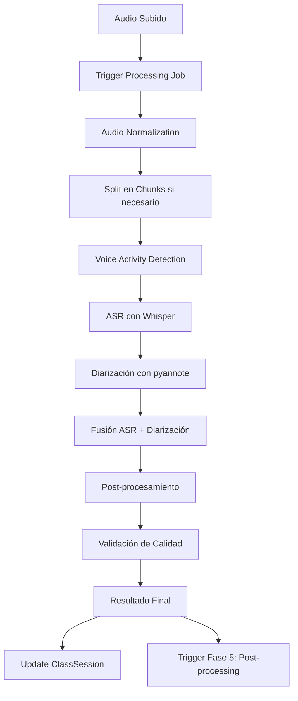

# B4.1 - Fase 4: ASR y Diarización (Núcleo de IA)

## 📋 Resumen de la Fase

La **Fase 4** implementa el núcleo central de inteligencia artificial del sistema Axonote, integrando **reconocimiento automático de voz (ASR)** con Whisper/WhisperX y **diarización de speakers** con pyannote-audio. Esta fase convierte los archivos de audio de las clases médicas en transcripciones precisas con separación de speakers, optimizada para el hardware del servidor (RTX 4090 24GB).

### 🎯 Objetivos de la Fase 4

1. **Sistema ASR completo** con Whisper/WhisperX optimizado para CUDA
2. **Diarización avanzada** con pyannote-audio para separación de speakers (profesor/alumnos)
3. **Pipeline de procesamiento** asíncrono con Celery para audio de larga duración
4. **Gestión de calidad** con métricas de confianza y validación
5. **Optimización de rendimiento** para aprovechar RTX 4090 24GB al máximo
6. **Sistema de recovery** para procesamiento interrumpido
7. **APIs REST** para trigger y monitorización del procesamiento

## 🏗️ Arquitectura de IA Implementada

### **Stack Tecnológico de Machine Learning**

```yaml
ASR (Automatic Speech Recognition):
  - Whisper: Modelo large-v3 con precision float16
  - WhisperX: Alineación temporal de palabras y VAD optimizado
  - faster-whisper: Implementación CUDA optimizada
  - Torch: Backend con CUDA 11.8+ support

Diarización:
  - pyannote-audio: Pipeline v3.1 state-of-the-art
  - Speaker embeddings: Optimizado para voces italianas/españolas
  - VAD: Voice Activity Detection avanzado
  - Clustering: Agrupación inteligente de speakers

Hardware Optimization:
  - GPU: RTX 4090 24GB VRAM utilización óptima
  - CUDA: Compute Capability 8.9, float16 precision
  - Memory: Gestión eficiente de VRAM para modelos grandes
  - Batching: Procesamiento de chunks en paralelo
```

### **Nuevos Servicios de IA**

#### 1. WhisperService - ASR Optimizado

```python
class WhisperService(BaseService):
    """
    Servicio principal de ASR con Whisper/WhisperX.
    Optimizado para hardware RTX 4090 y procesamiento médico.
    """
    
    def __init__(self):
        self.modelo_whisper: Optional[WhisperModel] = None
        self.modelo_whisperx: Optional[Any] = None
        self.device: str = "cuda"
        self.compute_type: str = "float16"
        self.modelo_size: str = "large-v3"
        
    async def setup_models(self) -> None:
        """Cargar modelos Whisper con configuración CUDA."""
        
    async def transcribir_audio(
        self, 
        ruta_audio: str,
        idioma: str = "it",
        usar_vad: bool = True,
        usar_alineacion: bool = True
    ) -> ResultadoTranscripcion:
        """
        Transcribir audio con máxima precisión y alineación temporal.
        
        Returns:
            ResultadoTranscripcion con texto, timestamps, confianza y métricas
        """
        
    async def procesar_con_vad(self, audio_array: np.ndarray) -> List[SegmentoVAD]:
        """Voice Activity Detection para filtrar silencio."""
        
    async def optimizar_memoria_gpu(self) -> Dict[str, Any]:
        """Gestión inteligente de memoria GPU para evitar OOM."""
```

**Configuraciones de modelo optimizadas**:
```python
WHISPER_CONFIGS = {
    "MEDICAL_HIGH_PRECISION": {
        "model_size": "large-v3",
        "compute_type": "float16",
        "device": "cuda",
        "language": "it",
        "vad_filter": True,
        "word_timestamps": True,
        "hallucination_silence_threshold": 0.2,
        "compression_ratio_threshold": 2.4,
        "log_prob_threshold": -1.0,
        "no_speech_threshold": 0.6,
        "condition_on_previous_text": True,
        "initial_prompt": "Esta es una clase de medicina en italiano. Incluye terminología médica, nombres de medicamentos y conceptos clínicos."
    },
    
    "MEDICAL_FAST": {
        "model_size": "medium",
        "compute_type": "int8_float16",
        # ... configuración optimizada para velocidad
    },
    
    "MEDICAL_MULTILINGUAL": {
        # Configuración para clases multilingües (italiano/inglés)
        "model_size": "large-v3",
        "language": None,  # Auto-detect
        "task": "transcribe"
    }
}
```

#### 2. DiarizationService - Separación de Speakers

```python
class DiarizationService(BaseService):
    """
    Servicio de diarización con pyannote-audio v3.1.
    Separa voces de profesor y alumnos en clases médicas.
    """
    
    def __init__(self):
        self.pipeline_diarizacion: Optional[SpeakerDiarization] = None
        self.embedding_model: Optional[Any] = None
        self.device: torch.device = torch.device("cuda")
        
    async def setup_models(self) -> None:
        """Configurar pipeline de diarización con autenticación HF."""
        
    async def diarizar_audio(
        self,
        ruta_audio: str,
        num_speakers: Optional[int] = None,
        min_speakers: int = 1,
        max_speakers: int = 6
    ) -> ResultadoDiarizacion:
        """
        Separar speakers en el audio con clustering inteligente.
        
        Args:
            ruta_audio: Path del archivo de audio
            num_speakers: Número exacto si se conoce
            min_speakers: Mínimo de speakers esperados
            max_speakers: Máximo de speakers (profesor + alumnos)
            
        Returns:
            ResultadoDiarizacion con segmentos, embeddings y clasificación
        """
        
    async def clasificar_speakers(
        self, 
        segmentos_diarizacion: List[SegmentoDiarizacion],
        audio_array: np.ndarray
    ) -> Dict[str, TipoSpeaker]:
        """
        Clasificar speakers en rol médico (profesor, alumno_1, alumno_2, etc.).
        
        Usa heurísticas médicas:
        - Speaker con más tiempo -> probable profesor
        - Análisis de preguntas vs respuestas
        - Patrones de vocabulario médico
        """
        
    async def optimizar_clustering(
        self, 
        embeddings: np.ndarray,
        metadatos_clase: Dict[str, Any]
    ) -> ParametrosClustering:
        """Optimizar parámetros de clustering basado en contexto médico."""
```

**Configuraciones de diarización**:
```python
DIARIZATION_CONFIGS = {
    "MEDICAL_CLASS_STANDARD": {
        "model": "pyannote/speaker-diarization-3.1", 
        "embedding_model": "pyannote/embedding",
        "clustering": "AgglomerativeClustering",
        "min_speakers": 1,
        "max_speakers": 6,  # 1 profesor + hasta 5 alumnos
        "segmentation_step": 0.1,  # 100ms precision
        "embedding_batch_size": 32,
        "use_auth_token": True
    },
    
    "MEDICAL_SMALL_GROUP": {
        "min_speakers": 1,
        "max_speakers": 3,  # Sesiones pequeñas
        # ... más configuración
    },
    
    "MEDICAL_LARGE_LECTURE": {
        "min_speakers": 1, 
        "max_speakers": 10,  # Clases grandes con más participación
        # ... configuración para aulas grandes
    }
}
```

#### 3. AudioProcessingService - Preprocessamiento Inteligente

```python
class AudioProcessingService(BaseService):
    """
    Servicio de procesamiento y normalización de audio.
    Optimiza audio para máxima precisión en ASR y diarización.
    """
    
    async def normalizar_audio_para_asr(
        self, 
        ruta_entrada: str,
        ruta_salida: str
    ) -> ResultadoNormalizacion:
        """
        Normalizar audio con parámetros optimizados para Whisper.
        
        Optimizaciones:
        - Sample rate: 16kHz (óptimo para Whisper)
        - Formato: WAV/FLAC sin compresión
        - Filtros: High-pass 80Hz, Low-pass 8kHz
        - Normalización de volumen con compresión dinámica suave
        - Reducción de ruido preservando frecuencias de voz
        """
        
    async def detectar_caracteristicas_audio(
        self, 
        ruta_audio: str
    ) -> CaracteristicasAudio:
        """
        Analizar características del audio para optimizar processing.
        
        Detecta:
        - Calidad de grabación
        - Nivel de ruido de fondo
        - Número aproximado de speakers
        - Idioma predominante
        - Duración de silencios
        """
        
    async def split_audio_por_chunks(
        self,
        ruta_audio: str,
        chunk_duration_sec: int = 600  # 10 minutos por chunk
    ) -> List[ChunkAudio]:
        """Dividir audio largo en chunks para procesamiento eficiente."""
```

### **Nuevos Modelos de Base de Datos**

#### ProcessingJob - Control de Pipeline de IA

```python
class ProcessingJob(BaseModel):
    """Gestión completa de jobs de procesamiento de IA."""
    
    # Información básica
    class_session_id: UUID           # Relación con ClassSession  
    tipo_procesamiento: TipoProcesamiento  # asr_only, diarization_only, full_pipeline
    prioridad: PrioridadProcesamiento      # urgent, high, normal, low
    
    # Estado del job
    estado: EstadoProcesamiento      # pendiente, procesando, completado, error
    progreso_porcentaje: float       # 0.0 - 100.0
    etapa_actual: EtapaProcesamiento # normalizacion, asr, diarizacion, post_processing
    
    # Configuración
    config_whisper: JSON            # Configuración específica Whisper
    config_diarizacion: JSON        # Configuración diarización
    usar_vad: bool                  # Voice Activity Detection
    usar_alineacion_temporal: bool  # Word-level timestamps
    
    # Archivos y rutas
    ruta_audio_original: str        # Audio subido por chunks
    ruta_audio_normalizado: str     # Audio preprocessado 
    chunks_audio: JSON              # Lista de chunks para procesamiento
    
    # Resultados
    transcripcion_completa: JSON    # Resultado ASR estructurado
    diarizacion_completa: JSON      # Resultado diarización
    metricas_calidad: JSON          # Métricas de confianza y calidad
    
    # Timing y rendimiento
    tiempo_inicio: datetime
    tiempo_fin: Optional[datetime]
    tiempo_estimado_sec: Optional[int]
    tiempo_procesamiento_total_sec: Optional[float]
    
    # Gestión de errores
    errores: JSON                   # Log de errores encontrados
    reintentos: int                 # Número de reintentos
    max_reintentos: int            # Límite de reintentos
    
    # Hardware y optimización
    device_usado: str              # cuda/cpu
    memoria_gpu_usada_mb: Optional[int]
    tiempo_gpu_sec: Optional[float]
```

#### TranscriptionResult - Resultados ASR Estructurados

```python
class TranscriptionResult(BaseModel):
    """Resultados detallados de transcripción con Whisper."""
    
    processing_job_id: UUID         # Relación con ProcessingJob
    
    # Transcripción principal
    texto_completo: str            # Transcripción final limpia
    texto_raw: str                 # Transcripción sin procesar
    idioma_detectado: str          # Código idioma (it, en, es)
    confianza_global: float        # Confianza promedio (0.0-1.0)
    
    # Segmentos con timestamps
    segmentos: JSON                # Lista de segmentos con timing preciso
    palabras_con_timestamps: JSON  # Word-level alignment
    
    # Métricas de calidad
    num_palabras: int
    duracion_audio_sec: float
    palabras_por_minuto: float
    nivel_ruido_estimado: float
    
    # Detección de contenido médico
    terminologia_medica_detectada: JSON  # Términos médicos identificados
    probabilidad_contenido_medico: float # Confianza de contexto médico
    
    # Metadatos técnicos
    modelo_whisper_usado: str      # large-v3, medium, etc.
    compute_type_usado: str        # float16, int8
    vad_usado: bool
    tiempo_procesamiento_sec: float
```

#### DiarizationResult - Resultados de Separación de Speakers

```python
class DiarizationResult(BaseModel):
    """Resultados detallados de diarización con pyannote."""
    
    processing_job_id: UUID        # Relación con ProcessingJob
    
    # Speakers identificados
    num_speakers_detectados: int
    speakers_clasificados: JSON    # {speaker_id: {tipo, confianza, nombre_estimado}}
    
    # Segmentos de speech
    segmentos_diarizacion: JSON    # Lista con [start, end, speaker_id, confianza]
    embeddings_speakers: JSON     # Embeddings para re-identificación
    
    # Clasificación en roles médicos
    speaker_profesor: Optional[str]     # ID del speaker identificado como profesor
    speakers_alumnos: JSON             # Lista de IDs de speakers alumnos
    confianza_clasificacion: float     # Confianza en clasificación de roles
    
    # Análisis de participación
    tiempo_habla_por_speaker: JSON     # Tiempo de habla de cada speaker
    turnos_de_palabra: JSON            # Análisis de turnos de conversación
    overlaps_detectados: JSON         # Solapamientos de speech
    
    # Métricas de calidad
    calidad_separacion: float          # Métrica de calidad de clustering
    segmentos_ambiguos: int            # Segmentos con speaker incierto
    
    # Metadatos técnicos
    modelo_diarizacion_usado: str      # pyannote/speaker-diarization-3.1
    parametros_clustering: JSON       # Parámetros usados para clustering
    tiempo_procesamiento_sec: float
```

## 🔄 Pipeline de Procesamiento Completo

### **Workflow Principal**



### **Etapas Detalladas del Pipeline**

#### 1. **Trigger Inicial** (0-5 segundos)
```python
# Cuando se completa upload de chunks (Fase 3)
processing_job = await crear_processing_job(
    class_session_id=session.id,
    tipo_procesamiento="full_pipeline",
    prioridad="high",
    config_whisper=WHISPER_CONFIGS["MEDICAL_HIGH_PRECISION"],
    config_diarizacion=DIARIZATION_CONFIGS["MEDICAL_CLASS_STANDARD"]
)

# Enviar a queue de Celery
task = procesar_audio_completo.delay(
    processing_job_id=processing_job.id,
    ruta_audio=session.storage_path_final
)
```

#### 2. **Normalización de Audio** (30-120 segundos)
```python
async def normalizar_audio(job: ProcessingJob) -> str:
    """
    Normalizar audio con ffmpeg optimizado para ASR.
    """
    # Configuración ffmpeg optimizada para Whisper
    comando_ffmpeg = [
        "ffmpeg", "-i", job.ruta_audio_original,
        "-ar", "16000",           # Sample rate óptimo para Whisper
        "-ac", "1",               # Mono
        "-c:a", "pcm_s16le",      # PCM sin compresión
        "-af", "highpass=f=80,lowpass=f=8000,volume=0.95",  # Filtros
        "-y", ruta_normalizada
    ]
    
    # Ejecutar con monitorización
    resultado = await ejecutar_comando_async(comando_ffmpeg)
    
    return ruta_normalizada
```

#### 3. **Voice Activity Detection** (10-30 segundos)
```python
async def aplicar_vad(ruta_audio: str) -> List[SegmentoVAD]:
    """
    Detectar segmentos con speech usando VAD de WhisperX.
    """
    audio = whisperx.load_audio(ruta_audio)
    
    # VAD con modelo optimizado
    vad_model, _ = whisperx.load_vad_model(
        device="cuda",
        vad_onset=0.500,
        vad_offset=0.363
    )
    
    segmentos_vad = vad_model({"audio": audio})
    
    return procesar_segmentos_vad(segmentos_vad)
```

#### 4. **ASR con Whisper** (60-300 segundos dependiendo de duración)
```python
async def transcribir_con_whisper(
    job: ProcessingJob, 
    segmentos_vad: List[SegmentoVAD]
) -> TranscriptionResult:
    """
    Transcripción principal con Whisper large-v3.
    """
    # Cargar modelo con configuración optimizada
    modelo = WhisperModel(
        job.config_whisper["model_size"],
        device="cuda",
        compute_type="float16",
        cpu_threads=8
    )
    
    # Transcribir por segmentos VAD
    resultados_segmentos = []
    for segmento in segmentos_vad:
        audio_chunk = extraer_audio_segmento(segmento)
        
        segmentos, info = modelo.transcribe(
            audio_chunk,
            language="it",
            word_timestamps=True,
            vad_filter=False,  # Ya aplicado
            hallucination_silence_threshold=0.2
        )
        
        resultados_segmentos.extend(segmentos)
    
    # Alineación temporal precisa con WhisperX
    if job.usar_alineacion_temporal:
        resultados_segmentos = await aplicar_alineacion_whisperx(
            resultados_segmentos, 
            ruta_audio
        )
    
    return crear_transcription_result(resultados_segmentos, job)
```

#### 5. **Diarización con pyannote** (120-600 segundos)
```python
async def diarizar_con_pyannote(
    job: ProcessingJob,
    ruta_audio: str
) -> DiarizationResult:
    """
    Separación de speakers con pyannote-audio v3.1.
    """
    # Cargar pipeline pre-entrenado
    pipeline = Pipeline.from_pretrained(
        "pyannote/speaker-diarization-3.1",
        use_auth_token=settings.HF_TOKEN
    ).to("cuda")
    
    # Configurar parámetros de clustering
    pipeline.instantiate({
        "segmentation": {
            "min_duration_off": 0.25,  # Mínimo silencio entre speakers
        },
        "clustering": {
            "threshold": 0.6,          # Umbral de similitud speakers
            "min_cluster_size": 5,     # Mínimo segmentos por speaker
        }
    })
    
    # Ejecutar diarización
    diarizacion = pipeline(ruta_audio)
    
    # Clasificar speakers en roles médicos
    clasificacion_speakers = await clasificar_speakers_medicos(
        diarizacion, 
        ruta_audio,
        job.class_session_id
    )
    
    return crear_diarization_result(diarizacion, clasificacion_speakers, job)
```

#### 6. **Fusión ASR + Diarización** (30-60 segundos)
```python
async def fusionar_asr_diarizacion(
    transcripcion: TranscriptionResult,
    diarizacion: DiarizationResult
) -> ResultadoFusion:
    """
    Combinar transcripción con información de speakers.
    """
    segmentos_fusionados = []
    
    for segmento_asr in transcripcion.segmentos:
        # Encontrar speaker correspondiente por timestamp
        speaker_id = encontrar_speaker_por_timestamp(
            segmento_asr["start"],
            segmento_asr["end"], 
            diarizacion.segmentos_diarizacion
        )
        
        segmento_fusionado = {
            "start": segmento_asr["start"],
            "end": segmento_asr["end"],
            "text": segmento_asr["text"],
            "speaker_id": speaker_id,
            "speaker_role": diarizacion.speakers_clasificados[speaker_id]["tipo"],
            "confidence_asr": segmento_asr["confidence"],
            "confidence_speaker": speaker_confidence
        }
        
        segmentos_fusionados.append(segmento_fusionado)
    
    return ResultadoFusion(
        segmentos=segmentos_fusionados,
        resumen_participacion=calcular_resumen_participacion(segmentos_fusionados)
    )
```

#### 7. **Post-procesamiento y Validación** (15-45 segundos)
```python
async def post_procesar_resultados(fusion: ResultadoFusion) -> Dict[str, Any]:
    """
    Limpieza final y validación de calidad.
    """
    # Corrección de errores comunes ASR
    texto_corregido = await corregir_errores_asr_medicos(fusion.texto_completo)
    
    # Validación de calidad
    metricas_calidad = await calcular_metricas_calidad(fusion)
    
    # Detección de terminología médica
    terminos_medicos = await extraer_terminologia_medica(texto_corregido)
    
    # Análisis de estructura de clase
    estructura_clase = await analizar_estructura_clase_medica(fusion)
    
    return {
        "texto_final": texto_corregido,
        "metricas_calidad": metricas_calidad,
        "terminologia_detectada": terminos_medicos,
        "estructura_clase": estructura_clase,
        "confianza_global": calcular_confianza_global(fusion, metricas_calidad)
    }
```

## 🔧 Implementación de Servicios

### **WhisperService Completo**

<function_calls>
<invoke name="todo_write">
<parameter name="merge">true
