# B5.1 - Fase 5: Post-procesamiento y Análisis LLM

## 📋 Resumen

La **Fase 5** implementa el sistema de post-procesamiento inteligente que transforma las transcripciones crudas de la Fase 4 en contenido estructurado y enriquecido mediante análisis con LLM local (Qwen2.5-14B) y corrección especializada para terminología médica italiana.

## 🎯 Objetivos

### **Objetivos Principales**
1. **Corrección inteligente de ASR** con diccionario médico italiano especializado
2. **Extracción de terminología médica** mediante Named Entity Recognition (NER)
3. **Análisis de estructura de clase** para identificar secciones pedagógicas
4. **Generación de resúmenes** con LLM local optimizado para contexto médico
5. **Métricas de calidad automáticas** para validación de contenido
6. **Preparación para Notion** con estructuración de datos lista para sincronización

### **Objetivos Técnicos**
- Pipeline de post-procesamiento robusto con 6 etapas
- Integración LLM local (Qwen2.5-14B) con fallback OpenAI
- Corrección de errores ASR específicos para italiano médico
- NER especializado para terminología médica
- Análisis de participación y estructura pedagógica
- Sistema de confianza y validación automática

## 🏗️ Implementación

### **Arquitectura del Pipeline**

```mermaid
graph TD
    A[TranscriptionResult] --> B[Corrección ASR]
    B --> C[NER Médico]
    C --> D[Análisis Estructura]
    D --> E[Generación Resumen LLM]
    E --> F[Métricas Calidad]
    F --> G[Preparación Notion]
    
    H[DiarizationResult] --> D
    I[Diccionario Médico IT] --> B
    J[LLM Local/Remoto] --> E
    K[Templates Médicos] --> E
```



### **Modelos de Base de Datos**

#### **1. LLMAnalysisResult**
```python
class LLMAnalysisResult(Base):
    """Resultado del análisis LLM de una transcripción."""
    
    __tablename__ = "llm_analysis_results"
    
    id: Mapped[UUID] = mapped_column(primary_key=True, default=uuid4)
    processing_job_id: Mapped[UUID] = mapped_column(ForeignKey("processing_jobs.id"))
    transcription_result_id: Mapped[UUID] = mapped_column(ForeignKey("transcription_results.id"))
    
    # Configuración del análisis
    llm_provider: Mapped[str] = mapped_column(String(50))  # "local", "openai"
    model_name: Mapped[str] = mapped_column(String(100))
    analysis_preset: Mapped[str] = mapped_column(String(50))
    
    # Resultados estructurados
    resumen_principal: Mapped[Optional[str]] = mapped_column(Text)
    conceptos_clave: Mapped[Optional[Dict]] = mapped_column(JSON)
    estructura_clase: Mapped[Optional[Dict]] = mapped_column(JSON)
    terminologia_medica: Mapped[Optional[Dict]] = mapped_column(JSON)
    
    # Métricas de calidad
    confianza_llm: Mapped[float] = mapped_column(Float, default=0.0)
    coherencia_score: Mapped[float] = mapped_column(Float, default=0.0)
    completitud_score: Mapped[float] = mapped_column(Float, default=0.0)
    needs_review: Mapped[bool] = mapped_column(Boolean, default=False)
    
    # Metadatos
    tiempo_procesamiento: Mapped[float] = mapped_column(Float)
    tokens_utilizados: Mapped[int] = mapped_column(Integer, default=0)
    costo_estimado: Mapped[float] = mapped_column(Float, default=0.0)
    
    created_at: Mapped[datetime] = mapped_column(DateTime(timezone=True), server_default=func.now())
    updated_at: Mapped[datetime] = mapped_column(DateTime(timezone=True), onupdate=func.now())
```

#### **2. PostProcessingResult**
```python
class PostProcessingResult(Base):
    """Resultado del post-procesamiento de transcripción."""
    
    __tablename__ = "post_processing_results"
    
    id: Mapped[UUID] = mapped_column(primary_key=True, default=uuid4)
    processing_job_id: Mapped[UUID] = mapped_column(ForeignKey("processing_jobs.id"))
    transcription_result_id: Mapped[UUID] = mapped_column(ForeignKey("transcription_results.id"))
    
    # Corrección ASR
    texto_original: Mapped[str] = mapped_column(Text)
    texto_corregido: Mapped[str] = mapped_column(Text)
    correcciones_aplicadas: Mapped[Dict] = mapped_column(JSON)
    confianza_correccion: Mapped[float] = mapped_column(Float, default=0.0)
    
    # NER Médico
    entidades_medicas: Mapped[Dict] = mapped_column(JSON)
    terminologia_detectada: Mapped[List[str]] = mapped_column(JSON)
    glosario_clase: Mapped[Dict] = mapped_column(JSON)
    
    # Análisis de estructura
    segmentos_identificados: Mapped[Dict] = mapped_column(JSON)
    participacion_speakers: Mapped[Dict] = mapped_column(JSON)
    momentos_clave: Mapped[List[Dict]] = mapped_column(JSON)
    
    # Métricas
    mejora_legibilidad: Mapped[float] = mapped_column(Float, default=0.0)
    precision_terminologia: Mapped[float] = mapped_column(Float, default=0.0)
    
    created_at: Mapped[datetime] = mapped_column(DateTime(timezone=True), server_default=func.now())
```

#### **3. MedicalTerminology**
```python
class MedicalTerminology(Base):
    """Diccionario de terminología médica italiana."""
    
    __tablename__ = "medical_terminology"
    
    id: Mapped[UUID] = mapped_column(primary_key=True, default=uuid4)
    
    # Término
    termino_original: Mapped[str] = mapped_column(String(200), index=True)
    termino_normalizado: Mapped[str] = mapped_column(String(200))
    categoria: Mapped[str] = mapped_column(String(50))  # anatomia, patologia, farmacologia, etc.
    
    # Definiciones
    definicion_italiana: Mapped[Optional[str]] = mapped_column(Text)
    definicion_espanola: Mapped[Optional[str]] = mapped_column(Text)
    sinonimos: Mapped[List[str]] = mapped_column(JSON, default=list)
    
    # Contexto
    especialidad_medica: Mapped[Optional[str]] = mapped_column(String(100))
    nivel_complejidad: Mapped[int] = mapped_column(Integer, default=1)  # 1-5
    frecuencia_uso: Mapped[int] = mapped_column(Integer, default=0)
    
    # Corrección ASR
    variantes_asr: Mapped[List[str]] = mapped_column(JSON, default=list)
    patron_correccion: Mapped[Optional[str]] = mapped_column(String(500))
    
    created_at: Mapped[datetime] = mapped_column(DateTime(timezone=True), server_default=func.now())
    updated_at: Mapped[datetime] = mapped_column(DateTime(timezone=True), onupdate=func.now())
```

### **Servicios Implementados**

#### **1. LLMService Completo**
```python
class LLMService(BaseService):
    """Servicio LLM para análisis de texto médico."""
    
    def __init__(self):
        super().__init__()
        self.local_client: Optional[httpx.AsyncClient] = None
        self.openai_client: Optional[OpenAI] = None
        self.monthly_cost: float = 0.0
        
    async def analyze_medical_transcription(
        self,
        transcription: str,
        diarization_data: Dict,
        preset: str = "MEDICAL_COMPREHENSIVE"
    ) -> Dict[str, Any]:
        """Análisis completo de transcripción médica."""
        
        # Seleccionar configuración
        config = self._get_analysis_config(preset)
        
        # Preparar contexto
        context = self._prepare_medical_context(transcription, diarization_data)
        
        # Ejecutar análisis
        if self._should_use_local_llm():
            result = await self._analyze_with_local_llm(context, config)
        else:
            result = await self._analyze_with_openai(context, config)
            
        return result
    
    def _get_analysis_config(self, preset: str) -> Dict:
        """Configuraciones predefinidas para análisis médico."""
        configs = {
            "MEDICAL_COMPREHENSIVE": {
                "max_tokens": 4000,
                "temperature": 0.1,
                "system_prompt": self._get_medical_system_prompt(),
                "tasks": ["resumen", "conceptos", "estructura", "terminologia"]
            },
            "MEDICAL_QUICK": {
                "max_tokens": 2000,
                "temperature": 0.2,
                "system_prompt": self._get_quick_system_prompt(),
                "tasks": ["resumen", "conceptos"]
            },
            "TERMINOLOGY_FOCUSED": {
                "max_tokens": 3000,
                "temperature": 0.05,
                "system_prompt": self._get_terminology_prompt(),
                "tasks": ["terminologia", "definiciones"]
            }
        }
        return configs.get(preset, configs["MEDICAL_COMPREHENSIVE"])
```

#### **2. PostProcessingService**
```python
class PostProcessingService(BaseService):
    """Servicio de post-procesamiento de transcripciones."""
    
    def __init__(self):
        super().__init__()
        self.medical_dict: Dict[str, str] = {}
        self.aho_corasick = None
        
    async def setup(self):
        """Configurar diccionario médico y algoritmos."""
        await self._load_medical_dictionary()
        await self._setup_aho_corasick()
        
    async def correct_asr_errors(
        self,
        transcription: str,
        confidence_threshold: float = 0.8
    ) -> Dict[str, Any]:
        """Corregir errores comunes de ASR en terminología médica."""
        
        corrections = []
        corrected_text = transcription
        
        # Aplicar correcciones del diccionario médico
        for original, corrected in self.medical_dict.items():
            if original.lower() in corrected_text.lower():
                corrected_text = re.sub(
                    re.escape(original), 
                    corrected, 
                    corrected_text, 
                    flags=re.IGNORECASE
                )
                corrections.append({
                    "original": original,
                    "corrected": corrected,
                    "confidence": 0.9
                })
        
        return {
            "original_text": transcription,
            "corrected_text": corrected_text,
            "corrections": corrections,
            "improvement_score": len(corrections) / max(len(transcription.split()), 1)
        }
    
    async def extract_medical_entities(
        self,
        text: str
    ) -> Dict[str, Any]:
        """Extraer entidades médicas mediante NER."""
        
        entities = {
            "anatomia": [],
            "patologia": [],
            "farmacologia": [],
            "procedimientos": [],
            "sintomas": []
        }
        
        # Usar Aho-Corasick para detección rápida
        matches = self.aho_corasick.iter(text.lower())
        
        for end_pos, (insert_order, original_keyword) in matches:
            start_pos = end_pos - len(original_keyword) + 1
            
            # Obtener información del término
            term_info = await self._get_term_info(original_keyword)
            if term_info:
                entities[term_info["categoria"]].append({
                    "termino": original_keyword,
                    "posicion": [start_pos, end_pos],
                    "definicion": term_info.get("definicion_italiana"),
                    "traduccion": term_info.get("definicion_espanola"),
                    "confianza": 0.95
                })
        
        return entities
```

#### **3. StructureAnalysisService**
```python
class StructureAnalysisService(BaseService):
    """Análisis de estructura pedagógica de clases médicas."""
    
    async def analyze_class_structure(
        self,
        transcription: str,
        diarization_data: Dict
    ) -> Dict[str, Any]:
        """Analizar estructura pedagógica de la clase."""
        
        # Identificar segmentos temporales
        segments = self._identify_temporal_segments(transcription, diarization_data)
        
        # Clasificar tipos de actividad
        activities = await self._classify_activities(segments)
        
        # Analizar participación
        participation = self._analyze_participation(diarization_data)
        
        # Detectar momentos clave
        key_moments = await self._detect_key_moments(segments)
        
        return {
            "segments": segments,
            "activities": activities,
            "participation": participation,
            "key_moments": key_moments,
            "class_flow": self._generate_class_flow(segments, activities)
        }
    
    def _classify_activities(self, segments: List[Dict]) -> List[Dict]:
        """Clasificar actividades pedagógicas."""
        activity_patterns = {
            "introduccion": ["bienvenidos", "oggi", "argomento", "iniziamo"],
            "explicacion": ["quindi", "per esempio", "importante", "ricordate"],
            "pregunta": ["domanda", "chi sa", "qualcuno", "?"],
            "respuesta": ["esatto", "corretto", "bene", "perfetto"],
            "resumen": ["riassumendo", "concludendo", "importante ricordare"],
            "cierre": ["fine", "prossima volta", "arrivederci", "grazie"]
        }
        
        classified = []
        for segment in segments:
            text = segment["text"].lower()
            scores = {}
            
            for activity, patterns in activity_patterns.items():
                score = sum(1 for pattern in patterns if pattern in text)
                scores[activity] = score / len(patterns)
            
            best_activity = max(scores, key=scores.get)
            classified.append({
                **segment,
                "activity_type": best_activity,
                "confidence": scores[best_activity]
            })
        
        return classified
```

### **Tareas Celery**

#### **Pipeline de Post-procesamiento**
```python
@celery_app.task(bind=True, name="post_processing.full_pipeline")
def post_processing_pipeline(
    self,
    processing_job_id: str,
    transcription_result_id: str,
    diarization_result_id: str,
    config: Dict[str, Any] = None
) -> Dict[str, Any]:
    """Pipeline completo de post-procesamiento."""
    
    try:
        # Actualizar progreso
        update_processing_progress(processing_job_id, 60, "Iniciando post-procesamiento")
        
        # 1. Corrección ASR (60-70%)
        correction_result = asr_correction_task.delay(
            transcription_result_id,
            config.get("correction_config", {})
        ).get()
        update_processing_progress(processing_job_id, 70, "Corrección ASR completada")
        
        # 2. NER Médico (70-80%)
        ner_result = medical_ner_task.delay(
            correction_result["corrected_text"]
        ).get()
        update_processing_progress(processing_job_id, 80, "Extracción de terminología completada")
        
        # 3. Análisis de estructura (80-85%)
        structure_result = structure_analysis_task.delay(
            correction_result["corrected_text"],
            diarization_result_id
        ).get()
        update_processing_progress(processing_job_id, 85, "Análisis de estructura completado")
        
        # 4. Análisis LLM (85-95%)
        llm_result = llm_analysis_task.delay(
            correction_result["corrected_text"],
            diarization_result_id,
            config.get("llm_config", {})
        ).get()
        update_processing_progress(processing_job_id, 95, "Análisis LLM completado")
        
        # 5. Métricas de calidad (95-98%)
        quality_metrics = quality_assessment_task.delay(
            correction_result,
            ner_result,
            structure_result,
            llm_result
        ).get()
        update_processing_progress(processing_job_id, 98, "Evaluación de calidad completada")
        
        # 6. Preparación Notion (98-100%)
        notion_data = prepare_notion_data_task.delay(
            llm_result,
            structure_result,
            ner_result
        ).get()
        update_processing_progress(processing_job_id, 100, "Post-procesamiento completado")
        
        return {
            "success": True,
            "correction_result": correction_result,
            "ner_result": ner_result,
            "structure_result": structure_result,
            "llm_result": llm_result,
            "quality_metrics": quality_metrics,
            "notion_data": notion_data
        }
        
    except Exception as e:
        logger.error(f"Error en pipeline post-procesamiento: {e}")
        update_processing_progress(processing_job_id, -1, f"Error: {str(e)}")
        raise
```

### **APIs REST**

#### **Endpoints de Post-procesamiento**
```python
@router.post("/post-processing/start/{processing_job_id}")
async def start_post_processing(
    processing_job_id: UUID,
    config: PostProcessingConfig = None
) -> Dict[str, Any]:
    """Iniciar post-procesamiento de una transcripción."""
    
    # Validar que existe el job y tiene transcripción
    job = await get_processing_job(processing_job_id)
    if not job or job.estado != "transcription_completed":
        raise HTTPException(400, "Job no válido o transcripción no completada")
    
    # Iniciar pipeline
    task = post_processing_pipeline.delay(
        str(processing_job_id),
        str(job.transcription_result_id),
        str(job.diarization_result_id),
        config.dict() if config else {}
    )
    
    # Actualizar job
    job.post_processing_task_id = task.id
    job.estado = "post_processing"
    await save_processing_job(job)
    
    return {
        "success": True,
        "task_id": task.id,
        "message": "Post-procesamiento iniciado"
    }

@router.get("/post-processing/results/llm/{llm_analysis_id}")
async def get_llm_analysis_result(
    llm_analysis_id: UUID
) -> Dict[str, Any]:
    """Obtener resultado de análisis LLM."""
    
    result = await get_llm_analysis_result(llm_analysis_id)
    if not result:
        raise HTTPException(404, "Resultado no encontrado")
    
    return {
        "success": True,
        "data": {
            "id": result.id,
            "llm_provider": result.llm_provider,
            "model_name": result.model_name,
            "resumen_principal": result.resumen_principal,
            "conceptos_clave": result.conceptos_clave,
            "estructura_clase": result.estructura_clase,
            "terminologia_medica": result.terminologia_medica,
            "confianza_llm": result.confianza_llm,
            "coherencia_score": result.coherencia_score,
            "completitud_score": result.completitud_score,
            "needs_review": result.needs_review,
            "tiempo_procesamiento": result.tiempo_procesamiento,
            "tokens_utilizados": result.tokens_utilizados,
            "costo_estimado": result.costo_estimado,
            "created_at": result.created_at
        }
    }
```

### **Configuración LLM**

#### **Variables de Entorno**
```bash
# LLM Local (Qwen2.5-14B)
LLM_PROVIDER=lmstudio                    # lmstudio, ollama
LMSTUDIO_BASE_URL=http://localhost:1234
OLLAMA_BASE_URL=http://localhost:11434
LLM_MODEL_NAME=qwen2.5-14b-instruct
LLM_MAX_TOKENS=4000
LLM_TEMPERATURE=0.1

# OpenAI Fallback
OPENAI_API_KEY=                          # Opcional
OPENAI_MODEL=gpt-4o-mini
OPENAI_MAX_MONTHLY_COST=25.0            # Límite en EUR
FEATURE_REMOTE_TURBO=false              # Desactivado por defecto

# Post-procesamiento
ENABLE_ASR_CORRECTION=true
ENABLE_MEDICAL_NER=true
ENABLE_STRUCTURE_ANALYSIS=true
MEDICAL_DICT_PATH=data/medical_dict_it.json
NER_CONFIDENCE_THRESHOLD=0.8
STRUCTURE_ANALYSIS_MIN_SEGMENT=30       # segundos

# Calidad y validación
QUALITY_MIN_COHERENCE=0.7
QUALITY_MIN_COMPLETENESS=0.6
AUTO_REVIEW_THRESHOLD=0.8
ENABLE_QUALITY_GATES=true
```

## ✅ Checklist de Validación

### **Implementación Core**
- [ ] Modelos de base de datos creados y migrados
- [ ] LLMService completamente implementado
- [ ] PostProcessingService funcional
- [ ] StructureAnalysisService operativo
- [ ] Tareas Celery del pipeline implementadas
- [ ] APIs REST completas y documentadas

### **Integración LLM**
- [ ] Conexión con LM Studio/Ollama funcional
- [ ] Fallback OpenAI configurado con límites
- [ ] Prompts médicos optimizados
- [ ] Sistema de tokens y costos implementado
- [ ] Health checks de servicios LLM

### **Post-procesamiento**
- [ ] Diccionario médico italiano cargado
- [ ] Corrección ASR funcionando
- [ ] NER médico extrayendo terminología
- [ ] Análisis de estructura clasificando actividades
- [ ] Métricas de calidad calculándose

### **Calidad y Validación**
- [ ] Pipeline completo ejecutándose sin errores
- [ ] Progreso en tiempo real funcionando
- [ ] Sistema de confianza y review implementado
- [ ] Logs estructurados y debugging
- [ ] Manejo de errores robusto

## 🔧 Troubleshooting

### **Problemas Comunes LLM**

#### **LM Studio no responde**
```bash
# Verificar estado
curl http://localhost:1234/v1/models

# Reiniciar servicio
# Desde LM Studio: Server → Stop → Start
```

#### **Memoria insuficiente para Qwen2.5-14B**
```bash
# Verificar memoria GPU
nvidia-smi

# Configurar modelo más pequeño
LLM_MODEL_NAME=qwen2.5-7b-instruct
```

#### **OpenAI límite excedido**
```bash
# Verificar costo mensual
curl http://localhost:8000/api/v1/llm/usage

# Resetear contador (inicio de mes)
curl -X POST http://localhost:8000/api/v1/llm/reset-usage
```

### **Problemas Post-procesamiento**

#### **Diccionario médico no carga**
```bash
# Verificar archivo
ls -la data/medical_dict_it.json

# Regenerar diccionario
python scripts/generate_medical_dict.py
```

#### **NER muy lento**
```bash
# Optimizar Aho-Corasick
MEDICAL_DICT_MAX_TERMS=10000

# Usar GPU para NER si disponible
NER_DEVICE=cuda
```

## 📊 Métricas

### **Performance Esperada**

| Duración Audio | Corrección ASR | NER Médico | Análisis LLM | Pipeline Completo |
|---------------|----------------|------------|--------------|-------------------|
| 30 minutos | 30-60 seg | 1-2 min | 2-4 min | 4-7 min |
| 1 hora | 1-2 min | 2-4 min | 4-8 min | 8-15 min |
| 2 horas | 2-4 min | 4-8 min | 8-16 min | 16-30 min |

### **Calidad Esperada**
- **Corrección ASR**: > 0.85 mejora en legibilidad
- **Precisión NER**: > 0.90 para terminología médica común
- **Coherencia LLM**: > 0.80 para resúmenes generados
- **Completitud**: > 0.75 cobertura de conceptos clave
- **Confianza global**: > 0.85 para contenido listo para Notion

### **Costos LLM**
- **Local (Qwen2.5-14B)**: €0.00 por análisis
- **OpenAI (gpt-4o-mini)**: €0.10-0.30 por hora de audio
- **Límite mensual**: €25.00 máximo
- **Uso recomendado**: 95% local, 5% OpenAI para casos complejos

## 🚀 Próximos Pasos

### **Fase 6 - Research y Fuentes Médicas**
1. **Integración con fuentes médicas** verificadas (WHO, CDC, NIH)
2. **Ampliación automática** de terminología con definiciones
3. **Sistema de citas** y referencias académicas
4. **Validación de contenido** contra fuentes oficiales
5. **Enriquecimiento contextual** de resúmenes

### **Optimizaciones Futuras**
- **Fine-tuning** de Qwen2.5 para terminología médica italiana
- **Cache inteligente** de análisis LLM similares
- **Análisis multimodal** incluyendo imágenes de pizarra
- **Personalización** por especialidad médica
- **Feedback loop** para mejora continua

---

**Estado**: 🔄 En Progreso  
**Fase**: 5 - Post-procesamiento y análisis LLM  
**Dependencias**: B4.1-Fase-4-ASR-y-Diarizacion.md (Completado)  
**Próximo**: B6.1-Fase-6-Research-Fuentes-Medicas.md
