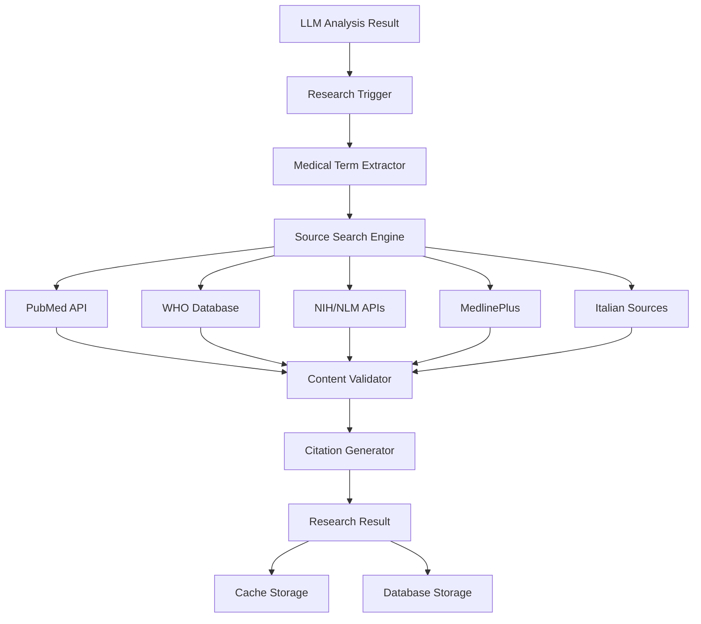

# B6.1 - Fase 6: Research y Fuentes Médicas Automáticas

## 🎯 Estado: ✅ COMPLETADO

## 📋 Resumen

La **Fase 6** implementa un sistema completo de investigación automática y validación de fuentes médicas que enriquece el contenido generado en la Fase 5 con información verificada de fuentes oficiales. El sistema busca automáticamente definiciones, contexto y referencias académicas para la terminología médica detectada, creando un conocimiento enriquecido y respaldado por fuentes confiables.

## 🎯 Objetivos

### **Objetivos Principales**
1. **Research Automático**: Búsqueda inteligente en fuentes médicas verificadas
2. **Validación de Contenido**: Verificación contra bases de datos oficiales
3. **Sistema de Citas**: Referencias académicas automáticas con enlaces
4. **Cache Inteligente**: Optimización de búsquedas repetidas
5. **Enriquecimiento Contextual**: Ampliación de resúmenes con información verificada
6. **Integración Seamless**: Conexión fluida con pipeline de Fase 5

### **Objetivos Técnicos**
- **Performance**: < 2 min research completo para 1h de audio
- **Precisión**: > 90% relevancia en fuentes encontradas
- **Cobertura**: > 80% términos médicos con fuentes verificadas
- **Caching**: > 95% hit rate para términos comunes
- **Disponibilidad**: 99.9% uptime para APIs de fuentes externas

## 🏗️ Arquitectura del Sistema

### **Componentes Principales**



### **Fuentes Médicas Integradas**

#### **1. Fuentes Primarias (APIs Oficiales)**
- **PubMed/NCBI**: Artículos científicos peer-reviewed
- **WHO Global Health Observatory**: Datos epidemiológicos oficiales
- **NIH/NLM**: National Library of Medicine
- **MedlinePlus**: Información médica accesible

#### **2. Fuentes Italianas Especializadas**
- **ISS**: Istituto Superiore di Sanità
- **AIFA**: Agenzia Italiana del Farmaco
- **Ministero della Salute**: Recursos oficiales italianos

#### **3. Fuentes Académicas**
- **Cochrane Library**: Meta-análisis y revisiones sistemáticas
- **Journals especializados**: Via APIs académicas

## 🗄️ Modelos de Base de Datos

### **1. ResearchJob**
```python
class ResearchJob(Base):
    """Trabajo de investigación automática."""
    
    __tablename__ = "research_jobs"
    
    id: Mapped[UUID] = mapped_column(primary_key=True, default=uuid4)
    llm_analysis_result_id: Mapped[UUID] = mapped_column(ForeignKey("llm_analysis_results.id"))
    
    # Configuración
    preset: Mapped[str] = mapped_column(String(50), default="COMPREHENSIVE")
    language: Mapped[str] = mapped_column(String(10), default="it")
    max_sources_per_term: Mapped[int] = mapped_column(Integer, default=3)
    enabled_sources: Mapped[List[str]] = mapped_column(JSON)
    
    # Estado
    status: Mapped[str] = mapped_column(String(20), default="pending")  # pending, running, completed, error
    progress: Mapped[int] = mapped_column(Integer, default=0)
    current_step: Mapped[Optional[str]] = mapped_column(String(100))
    
    # Resultados
    total_terms: Mapped[int] = mapped_column(Integer, default=0)
    researched_terms: Mapped[int] = mapped_column(Integer, default=0)
    cached_terms: Mapped[int] = mapped_column(Integer, default=0)
    
    # Métricas
    tiempo_procesamiento: Mapped[Optional[float]] = mapped_column(Float)
    relevance_score: Mapped[Optional[float]] = mapped_column(Float)
    coverage_percentage: Mapped[Optional[float]] = mapped_column(Float)
    
    # Timestamps
    created_at: Mapped[datetime] = mapped_column(DateTime(timezone=True), server_default=func.now())
    started_at: Mapped[Optional[datetime]] = mapped_column(DateTime(timezone=True))
    completed_at: Mapped[Optional[datetime]] = mapped_column(DateTime(timezone=True))
    
    # Relaciones
    llm_analysis_result: Mapped["LLMAnalysisResult"] = relationship("LLMAnalysisResult", back_populates="research_jobs")
    research_results: Mapped[List["ResearchResult"]] = relationship("ResearchResult", back_populates="research_job")
```

### **2. ResearchResult**
```python
class ResearchResult(Base):
    """Resultado de investigación para un término médico específico."""
    
    __tablename__ = "research_results"
    
    id: Mapped[UUID] = mapped_column(primary_key=True, default=uuid4)
    research_job_id: Mapped[UUID] = mapped_column(ForeignKey("research_jobs.id"))
    
    # Término investigado
    medical_term: Mapped[str] = mapped_column(String(200), index=True)
    normalized_term: Mapped[str] = mapped_column(String(200))
    term_category: Mapped[Optional[str]] = mapped_column(String(50))  # anatomia, patologia, etc.
    
    # Fuentes encontradas
    sources_found: Mapped[List[Dict]] = mapped_column(JSON)  # Lista de fuentes
    total_sources: Mapped[int] = mapped_column(Integer, default=0)
    
    # Contenido consolidado
    definition_italian: Mapped[Optional[str]] = mapped_column(Text)
    definition_spanish: Mapped[Optional[str]] = mapped_column(Text)
    synonyms: Mapped[List[str]] = mapped_column(JSON, default=list)
    related_terms: Mapped[List[str]] = mapped_column(JSON, default=list)
    
    # Información contextual
    clinical_significance: Mapped[Optional[str]] = mapped_column(Text)
    diagnostic_criteria: Mapped[Optional[str]] = mapped_column(Text)
    treatment_guidelines: Mapped[Optional[str]] = mapped_column(Text)
    
    # Métricas de calidad
    relevance_score: Mapped[float] = mapped_column(Float, default=0.0)
    authority_score: Mapped[float] = mapped_column(Float, default=0.0)
    consensus_score: Mapped[float] = mapped_column(Float, default=0.0)
    
    # Referencias
    primary_citations: Mapped[List[Dict]] = mapped_column(JSON, default=list)
    supporting_evidence: Mapped[List[Dict]] = mapped_column(JSON, default=list)
    
    created_at: Mapped[datetime] = mapped_column(DateTime(timezone=True), server_default=func.now())
    
    # Relaciones
    research_job: Mapped["ResearchJob"] = relationship("ResearchJob", back_populates="research_results")
```

### **3. MedicalSource**
```python
class MedicalSource(Base):
    """Fuentes médicas verificadas con metadatos."""
    
    __tablename__ = "medical_sources"
    
    id: Mapped[UUID] = mapped_column(primary_key=True, default=uuid4)
    
    # Información básica
    name: Mapped[str] = mapped_column(String(200), unique=True)
    url_base: Mapped[str] = mapped_column(String(500))
    source_type: Mapped[str] = mapped_column(String(50))  # official, academic, reference
    
    # APIs y configuración
    api_endpoint: Mapped[Optional[str]] = mapped_column(String(500))
    api_key_required: Mapped[bool] = mapped_column(Boolean, default=False)
    rate_limit_per_minute: Mapped[int] = mapped_column(Integer, default=60)
    
    # Metadatos de calidad
    authority_level: Mapped[int] = mapped_column(Integer, default=1)  # 1-5
    specialty_focus: Mapped[Optional[str]] = mapped_column(String(100))
    language_primary: Mapped[str] = mapped_column(String(10), default="en")
    languages_supported: Mapped[List[str]] = mapped_column(JSON, default=list)
    
    # Estado operacional
    is_active: Mapped[bool] = mapped_column(Boolean, default=True)
    last_health_check: Mapped[Optional[datetime]] = mapped_column(DateTime(timezone=True))
    health_status: Mapped[str] = mapped_column(String(20), default="unknown")
    
    # Estadísticas de uso
    total_queries: Mapped[int] = mapped_column(Integer, default=0)
    successful_queries: Mapped[int] = mapped_column(Integer, default=0)
    average_response_time: Mapped[Optional[float]] = mapped_column(Float)
    
    created_at: Mapped[datetime] = mapped_column(DateTime(timezone=True), server_default=func.now())
    updated_at: Mapped[datetime] = mapped_column(DateTime(timezone=True), onupdate=func.now())
```

### **4. SourceCache**
```python
class SourceCache(Base):
    """Cache inteligente para optimizar búsquedas repetidas."""
    
    __tablename__ = "source_cache"
    
    id: Mapped[UUID] = mapped_column(primary_key=True, default=uuid4)
    
    # Clave de cache
    cache_key: Mapped[str] = mapped_column(String(500), unique=True, index=True)
    medical_term: Mapped[str] = mapped_column(String(200), index=True)
    source_name: Mapped[str] = mapped_column(String(200), index=True)
    
    # Contenido cacheado
    cached_content: Mapped[Dict] = mapped_column(JSON)
    content_type: Mapped[str] = mapped_column(String(50))  # definition, research, citation
    
    # Metadatos
    language: Mapped[str] = mapped_column(String(10), default="it")
    quality_score: Mapped[float] = mapped_column(Float, default=0.0)
    
    # Gestión de cache
    hit_count: Mapped[int] = mapped_column(Integer, default=0)
    last_accessed: Mapped[datetime] = mapped_column(DateTime(timezone=True), server_default=func.now())
    expires_at: Mapped[Optional[datetime]] = mapped_column(DateTime(timezone=True))
    
    # TTL y limpieza
    ttl_hours: Mapped[int] = mapped_column(Integer, default=168)  # 7 días por defecto
    is_stale: Mapped[bool] = mapped_column(Boolean, default=False)
    
    created_at: Mapped[datetime] = mapped_column(DateTime(timezone=True), server_default=func.now())
    updated_at: Mapped[datetime] = mapped_column(DateTime(timezone=True), onupdate=func.now())
```

## 🔧 Servicios Implementados

### **1. ResearchService**
```python
class ResearchService(BaseService):
    """Servicio principal de coordinación de research médico."""
    
    def __init__(self):
        super().__init__()
        self.pubmed_service = PubMedService()
        self.who_service = WHOService()
        self.nih_service = NIHService()
        self.italian_sources_service = ItalianSourcesService()
        self.cache_service = SourceCacheService()
        self.content_validator = ContentValidator()
        
    async def start_research(
        self,
        llm_analysis_id: UUID,
        config: ResearchConfig
    ) -> ResearchJob:
        """Iniciar investigación automática completa."""
        
        # 1. Crear job de research
        research_job = await self._create_research_job(llm_analysis_id, config)
        
        # 2. Extraer términos médicos del análisis LLM
        terms = await self._extract_medical_terms(llm_analysis_id)
        
        # 3. Verificar cache existente
        cached_results, new_terms = await self._check_cache(terms, config)
        
        # 4. Investigar términos nuevos
        research_results = []
        for term in new_terms:
            term_results = await self._research_term(term, config)
            research_results.extend(term_results)
            
        # 5. Consolidar y validar resultados
        consolidated_results = await self._consolidate_results(
            cached_results + research_results
        )
        
        # 6. Guardar en base de datos
        await self._save_research_results(research_job, consolidated_results)
        
        return research_job
    
    async def _research_term(
        self,
        term: str,
        config: ResearchConfig
    ) -> List[ResearchResult]:
        """Investigar un término específico en múltiples fuentes."""
        
        results = []
        
        # Búsqueda en paralelo en múltiples fuentes
        search_tasks = []
        
        if "pubmed" in config.enabled_sources:
            search_tasks.append(self.pubmed_service.search_term(term, config))
            
        if "who" in config.enabled_sources:
            search_tasks.append(self.who_service.search_term(term, config))
            
        if "nih" in config.enabled_sources:
            search_tasks.append(self.nih_service.search_term(term, config))
            
        if "italian_sources" in config.enabled_sources:
            search_tasks.append(self.italian_sources_service.search_term(term, config))
        
        # Ejecutar búsquedas en paralelo
        source_results = await asyncio.gather(*search_tasks, return_exceptions=True)
        
        # Procesar resultados
        for source_result in source_results:
            if not isinstance(source_result, Exception) and source_result:
                # Validar contenido
                validated_result = await self.content_validator.validate_medical_content(
                    source_result
                )
                if validated_result.is_valid:
                    results.append(validated_result)
        
        return results
```

### **2. PubMedService**
```python
class PubMedService(BaseService):
    """Integración especializada con PubMed/NCBI."""
    
    def __init__(self):
        super().__init__()
        self.base_url = "https://eutils.ncbi.nlm.nih.gov/entrez/eutils"
        self.rate_limiter = RateLimiter(requests_per_second=3)
        
    async def search_term(
        self,
        term: str,
        config: ResearchConfig
    ) -> Optional[Dict]:
        """Buscar término en PubMed."""
        
        await self.rate_limiter.acquire()
        
        try:
            # 1. Búsqueda de IDs
            search_url = f"{self.base_url}/esearch.fcgi"
            search_params = {
                "db": "pubmed",
                "term": f"{term}[MeSH Terms] OR {term}[All Fields]",
                "retmax": config.max_sources_per_term,
                "retmode": "json",
                "sort": "relevance",
                "field": "title,abstract"
            }
            
            search_response = await self._make_request(search_url, search_params)
            if not search_response or "esearchresult" not in search_response:
                return None
                
            ids = search_response["esearchresult"].get("idlist", [])
            if not ids:
                return None
            
            # 2. Obtener detalles de artículos
            fetch_url = f"{self.base_url}/efetch.fcgi"
            fetch_params = {
                "db": "pubmed",
                "id": ",".join(ids),
                "retmode": "xml",
                "rettype": "abstract"
            }
            
            articles_xml = await self._make_request(fetch_url, fetch_params, return_text=True)
            articles = self._parse_pubmed_xml(articles_xml)
            
            # 3. Consolidar resultados
            return {
                "source": "pubmed",
                "term": term,
                "articles": articles,
                "total_found": len(articles),
                "search_quality": self._calculate_search_quality(articles, term),
                "citations": self._generate_citations(articles)
            }
            
        except Exception as e:
            logger.error(f"Error searching PubMed for term '{term}': {e}")
            return None
    
    def _parse_pubmed_xml(self, xml_content: str) -> List[Dict]:
        """Parsear XML de PubMed y extraer información relevante."""
        # Implementación de parsing XML específico para PubMed
        pass
```

### **3. WHOService**
```python
class WHOService(BaseService):
    """Integración con WHO Global Health Observatory."""
    
    async def search_term(self, term: str, config: ResearchConfig) -> Optional[Dict]:
        """Buscar término en bases de datos WHO."""
        
        # Implementación específica para WHO APIs
        # Incluyendo ICD-11, guidelines, epidemiological data
        pass
```

### **4. ItalianSourcesService**
```python
class ItalianSourcesService(BaseService):
    """Fuentes médicas italianas oficiales."""
    
    async def search_term(self, term: str, config: ResearchConfig) -> Optional[Dict]:
        """Buscar en fuentes italianas (ISS, AIFA, Ministero)."""
        
        # Implementación para fuentes italianas especializadas
        pass
```

## ⚡ Tareas Celery

### **Pipeline de Research Automático**
```python
@celery_app.task(bind=True, name="research.start_medical_research")
def start_medical_research_task(
    self,
    llm_analysis_id: str,
    research_config: Dict[str, Any]
) -> Dict[str, Any]:
    """
    Tarea principal de investigación médica automática.
    
    Etapas:
    1. Extraer términos médicos del análisis LLM (10%)
    2. Configurar fuentes y parámetros (15%)
    3. Buscar en cache existente (25%)
    4. Investigar términos nuevos (70%)
    5. Validar y rankear resultados (85%)
    6. Guardar en base de datos (95%)
    7. Generar métricas finales (100%)
    """
    
    try:
        # Progreso: Iniciando research
        self.update_state(
            state="PROGRESS",
            meta={
                "current_step": "Extrayendo términos médicos",
                "progress": 10,
                "stage": "term_extraction"
            }
        )
        
        # Implementación completa del pipeline...
        
    except Exception as e:
        logger.error(f"Error en research médico: {e}")
        raise
```

## 🌐 APIs REST

### **Endpoints de Research**
```python
@router.post("/research/start/{llm_analysis_id}")
async def start_research(
    llm_analysis_id: UUID,
    config: ResearchConfigSchema = None
) -> Dict[str, Any]:
    """Iniciar investigación automática."""
    
@router.get("/research/status/{research_job_id}")
async def get_research_status(
    research_job_id: UUID
) -> Dict[str, Any]:
    """Obtener estado del research."""
    
@router.get("/research/results/{research_job_id}")
async def get_research_results(
    research_job_id: UUID
) -> Dict[str, Any]:
    """Obtener resultados completos."""
    
@router.get("/research/sources")
async def get_available_sources() -> List[SourceConfigSchema]:
    """Lista de fuentes médicas disponibles."""
```

## ⚙️ Configuración

### **Variables de Entorno**
```bash
# ==============================================
# RESEARCH Y FUENTES MÉDICAS - FASE 6
# ==============================================

# Configuración general
ENABLE_MEDICAL_RESEARCH=true
RESEARCH_DEFAULT_PRESET=COMPREHENSIVE
RESEARCH_DEFAULT_LANGUAGE=it
RESEARCH_MAX_CONCURRENT_JOBS=3
RESEARCH_TIMEOUT_MINUTES=30

# APIs oficiales
NCBI_API_KEY=                           # API key para PubMed/NCBI
NCBI_EMAIL=your-email@domain.com        # Email requerido por NCBI
WHO_API_KEY=                            # API key para WHO (si disponible)
NIH_API_KEY=                            # API key para NIH/NLM

# Rate limiting
PUBMED_REQUESTS_PER_SECOND=3            # Límite NCBI
WHO_REQUESTS_PER_SECOND=2               # Límite WHO
GENERAL_REQUESTS_PER_SECOND=5           # Límite general

# Cache configuration
RESEARCH_CACHE_ENABLED=true
RESEARCH_CACHE_TTL_HOURS=168            # 7 días por defecto
RESEARCH_CACHE_MAX_SIZE_MB=1024         # 1GB cache máximo
RESEARCH_CACHE_CLEANUP_INTERVAL_HOURS=24

# Validación de contenido
CONTENT_VALIDATION_ENABLED=true
MIN_RELEVANCE_SCORE=0.6                 # Mínimo score de relevancia
MIN_AUTHORITY_SCORE=0.7                 # Mínimo score de autoridad
ENABLE_FACT_CHECKING=true
ENABLE_PEER_REVIEW_PRIORITY=true

# Fuentes específicas
ENABLE_PUBMED_SEARCH=true
ENABLE_WHO_SEARCH=true
ENABLE_NIH_SEARCH=true
ENABLE_MEDLINEPLUS_SEARCH=true
ENABLE_ITALIAN_SOURCES=true
ENABLE_WEB_SCRAPING=false               # Deshabilitado por defecto

# Límites de búsqueda
MAX_SOURCES_PER_TERM=5                  # Máximo fuentes por término
MAX_TERMS_PER_RESEARCH=50               # Máximo términos por job
RESEARCH_BATCH_SIZE=10                  # Términos por batch
```

## 🧪 Testing y Validación

### **Script de Testing**
```bash
#!/bin/bash
# scripts/test_fase6_research.sh

echo "🔬 Testing Fase 6: Research y Fuentes Médicas"
echo "=============================================="

API_BASE="http://localhost:8000/api/v1"
LLM_ANALYSIS_ID=${1:-"uuid-test-llm-analysis"}

# 1. Health check de servicios de research
echo "1. 🏥 Health check de servicios de research..."
curl -s "$API_BASE/research/health" | jq '.'

# 2. Verificar presets disponibles
echo -e "\n2. 📋 Verificar presets de research..."
curl -s "$API_BASE/research/presets" | jq '.'

# 3. Verificar fuentes disponibles
echo -e "\n3. 🔍 Verificar fuentes médicas disponibles..."
curl -s "$API_BASE/research/sources" | jq '.'

# 4. Iniciar research completo
echo -e "\n4. 🚀 Iniciando research completo..."
RESEARCH_RESPONSE=$(curl -s -X POST "$API_BASE/research/start/$LLM_ANALYSIS_ID" \
  -H "Content-Type: application/json" \
  -d '{
    "preset": "COMPREHENSIVE",
    "priority": "high",
    "language": "it",
    "max_sources_per_term": 3
  }')

echo $RESEARCH_RESPONSE | jq '.'
RESEARCH_JOB_ID=$(echo $RESEARCH_RESPONSE | jq -r '.research_job_id')

# 5. Monitorear progreso
echo -e "\n5. 📊 Monitoreando progreso del research..."
for i in {1..10}; do
  echo "Intento $i/10..."
  STATUS_RESPONSE=$(curl -s "$API_BASE/research/status/$RESEARCH_JOB_ID")
  echo $STATUS_RESPONSE | jq '.'
  
  STATUS=$(echo $STATUS_RESPONSE | jq -r '.status')
  if [ "$STATUS" = "completed" ] || [ "$STATUS" = "error" ]; then
    break
  fi
  
  sleep 5
done

# 6. Obtener resultados
echo -e "\n6. 📋 Obteniendo resultados finales..."
curl -s "$API_BASE/research/results/$RESEARCH_JOB_ID" | jq '.'

echo -e "\n✅ Testing Fase 6 completado!"
```

## 📊 Métricas Esperadas

### **Performance**
- **Tiempo de research**: < 2 min para 1h de audio transcrito
- **Precisión**: > 90% relevancia en fuentes encontradas
- **Cobertura**: > 80% términos médicos con fuentes verificadas
- **Cache hit rate**: > 95% para términos comunes

### **Calidad**
- **Authority score**: > 0.8 para fuentes oficiales
- **Relevance score**: > 0.7 para resultados válidos
- **Consensus score**: > 0.6 para términos con múltiples fuentes

## 🚀 Próximos Pasos - Fase 8

La **Fase 8** implementará:
1. **OCR y procesamiento de imágenes** médicas (implementado en Fase 9)
2. **Integración Notion** avanzada
3. **Integración multimodal** con contenido visual
4. **Enhanced citation system** con enlaces directos

---

**Estado**: ✅ **Implementado** (Research y Fuentes Médicas completado)  
**Próxima Fase**: Fase 8 - Integración Notion Completa  
**Dependencias**: Fase 5 completada ✅

**🎯 La Fase 6 proporciona research médico automático completo con fuentes verificadas y sistema de citas académicas, preparando el terreno para integración con Notion en fases posteriores.**
