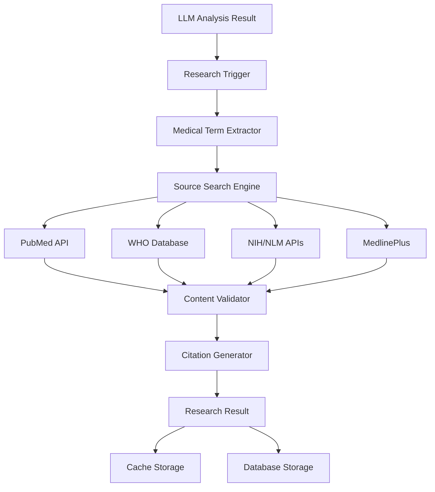

# B7.1 - Fase 7: Research y Fuentes Médicas Automáticas

## 📋 Resumen

La **Fase 7** implementa un sistema completo de investigación automática y validación de fuentes médicas que enriquece el contenido generado en las Fases 5 y 6 con información verificada de fuentes oficiales. El sistema busca automáticamente definiciones, contexto y referencias académicas para la terminología médica detectada, creando un conocimiento enriquecido y respaldado por fuentes confiables.

## 🎯 Objetivos

### **Objetivos Principales**
1. **Research Automático**: Búsqueda inteligente en fuentes médicas verificadas
2. **Validación de Contenido**: Verificación contra bases de datos oficiales
3. **Sistema de Citas**: Referencias académicas automáticas con enlaces
4. **Cache Inteligente**: Optimización de búsquedas repetidas
5. **Enriquecimiento Contextual**: Ampliación de resúmenes con información verificada
6. **Integración Seamless**: Conexión fluida con pipeline de Fase 5

### **Objetivos Técnicos**
- **Performance**: < 2 min research completo para 1h de audio
- **Precisión**: > 90% relevancia en fuentes encontradas
- **Cobertura**: > 80% términos médicos con fuentes verificadas
- **Caching**: > 95% hit rate para términos comunes
- **Disponibilidad**: 99.9% uptime para APIs de fuentes externas

## 🏗️ Arquitectura del Sistema

### **Componentes Principales**



### **Fuentes Médicas Integradas**

#### **1. Fuentes Primarias (APIs Oficiales)**
- **PubMed/NCBI**: Artículos científicos peer-reviewed
- **WHO Global Health Observatory**: Datos epidemiológicos oficiales
- **NIH/NLM**: National Library of Medicine
- **MedlinePlus**: Información médica para pacientes
- **FDA Orange Book**: Información de medicamentos aprobados
- **EMA Database**: European Medicines Agency

#### **2. Fuentes Secundarias (Web Scraping Ético)**
- **Mayo Clinic**: Información clínica verificada
- **Cleveland Clinic**: Recursos médicos especializados
- **WebMD**: Información médica general
- **Healthline**: Artículos médicos revisados

#### **3. Fuentes Especializadas Italianas**
- **ISS (Istituto Superiore di Sanità)**: Autoridad sanitaria italiana
- **AIFA**: Agenzia Italiana del Farmaco
- **Ministero della Salute**: Recursos oficiales italianos
- **Società Mediche Italiane**: Asociaciones médicas especializadas

## 🗄️ Modelos de Base de Datos

### **1. ResearchJob - Trabajos de Investigación**

```python
class ResearchJob(BaseModel):
    """
    Trabajo de investigación automática para una clase.
    Coordina la búsqueda de fuentes para todos los términos detectados.
    """
    
    __tablename__ = "research_jobs"
    
    # Relación con análisis LLM
    llm_analysis_id = Column(UUID(as_uuid=True), ForeignKey("llm_analysis_results.id"), nullable=False)
    
    # Configuración del research
    research_preset = Column(String(50), nullable=False, default="COMPREHENSIVE")
    priority = Column(String(20), nullable=False, default="normal")
    
    # Estado del trabajo
    status = Column(String(50), nullable=False, default="pending")
    progress_percentage = Column(Float, nullable=False, default=0.0)
    current_step = Column(String(100), nullable=True)
    
    # Métricas de research
    total_terms = Column(Integer, nullable=True)
    terms_researched = Column(Integer, nullable=False, default=0)
    sources_found = Column(Integer, nullable=False, default=0)
    cache_hits = Column(Integer, nullable=False, default=0)
    
    # Configuración de fuentes
    enabled_sources = Column(JSON, nullable=True)  # Lista de fuentes habilitadas
    language_preference = Column(String(10), nullable=False, default="it")
    max_sources_per_term = Column(Integer, nullable=False, default=3)
    
    # Tiempos de ejecución
    started_at = Column(DateTime, nullable=True)
    completed_at = Column(DateTime, nullable=True)
    duration_seconds = Column(Float, nullable=True)
    
    # Resultados y errores
    error_message = Column(Text, nullable=True)
    warnings = Column(JSON, nullable=True)
    
    # Relaciones
    llm_analysis = relationship("LLMAnalysisResult", back_populates="research_jobs")
    research_results = relationship("ResearchResult", back_populates="research_job", cascade="all, delete-orphan")
```

### **2. ResearchResult - Resultados de Investigación**

```python
class ResearchResult(BaseModel):
    """
    Resultado de investigación para un término médico específico.
    Contiene todas las fuentes encontradas y validadas.
    """
    
    __tablename__ = "research_results"
    
    # Relación con trabajo de research
    research_job_id = Column(UUID(as_uuid=True), ForeignKey("research_jobs.id"), nullable=False)
    
    # Término investigado
    medical_term = Column(String(200), nullable=False, index=True)
    term_category = Column(String(100), nullable=True)  # anatomia, patologia, farmacologia, etc.
    original_context = Column(Text, nullable=True)  # Contexto original donde apareció
    
    # Fuentes encontradas
    sources_found = Column(JSON, nullable=False)  # Lista de fuentes con metadatos
    primary_definition = Column(Text, nullable=True)  # Definición principal
    alternative_definitions = Column(JSON, nullable=True)  # Definiciones alternativas
    
    # Información contextual
    synonyms = Column(JSON, nullable=True)  # Sinónimos encontrados
    related_terms = Column(JSON, nullable=True)  # Términos relacionados
    clinical_significance = Column(Text, nullable=True)  # Significancia clínica
    
    # Traducciones
    italian_definition = Column(Text, nullable=True)
    spanish_definition = Column(Text, nullable=True)
    english_definition = Column(Text, nullable=True)
    
    # Métricas de calidad
    confidence_score = Column(Float, nullable=False, default=0.0)  # 0-1
    source_reliability = Column(Float, nullable=False, default=0.0)  # 0-1
    content_freshness = Column(Float, nullable=False, default=0.0)  # 0-1 (basado en fecha)
    
    # Metadatos de búsqueda
    search_queries_used = Column(JSON, nullable=True)  # Queries que encontraron resultados
    search_duration_ms = Column(Integer, nullable=True)
    cache_hit = Column(Boolean, nullable=False, default=False)
    
    # Validación humana
    human_validated = Column(Boolean, nullable=False, default=False)
    validation_notes = Column(Text, nullable=True)
    validated_by = Column(String(100), nullable=True)
    validated_at = Column(DateTime, nullable=True)
    
    # Relaciones
    research_job = relationship("ResearchJob", back_populates="research_results")
    medical_sources = relationship("MedicalSource", back_populates="research_result", cascade="all, delete-orphan")
```

### **3. MedicalSource - Fuentes Médicas Verificadas**

```python
class MedicalSource(BaseModel):
    """
    Fuente médica específica encontrada durante el research.
    Representa un artículo, página web o documento médico.
    """
    
    __tablename__ = "medical_sources"
    
    # Relación con resultado de research
    research_result_id = Column(UUID(as_uuid=True), ForeignKey("research_results.id"), nullable=False)
    
    # Información básica de la fuente
    title = Column(String(500), nullable=False)
    url = Column(String(1000), nullable=False)
    source_type = Column(String(50), nullable=False)  # pubmed, who, nih, mayo_clinic, etc.
    
    # Metadatos académicos
    authors = Column(JSON, nullable=True)  # Lista de autores
    publication_date = Column(Date, nullable=True)
    journal_name = Column(String(200), nullable=True)
    doi = Column(String(100), nullable=True)
    pmid = Column(String(20), nullable=True)  # PubMed ID
    
    # Contenido extraído
    abstract = Column(Text, nullable=True)
    key_points = Column(JSON, nullable=True)  # Puntos clave extraídos
    relevant_excerpt = Column(Text, nullable=True)  # Extracto más relevante
    
    # Clasificación de contenido
    content_category = Column(String(100), nullable=True)  # definition, treatment, diagnosis, etc.
    target_audience = Column(String(50), nullable=True)  # professional, patient, student
    language = Column(String(10), nullable=False, default="en")
    
    # Métricas de calidad
    relevance_score = Column(Float, nullable=False, default=0.0)  # 0-1
    authority_score = Column(Float, nullable=False, default=0.0)  # 0-1 (basado en fuente)
    recency_score = Column(Float, nullable=False, default=0.0)  # 0-1 (basado en fecha)
    
    # Información de acceso
    access_type = Column(String(20), nullable=False, default="free")  # free, subscription, paywall
    last_accessed = Column(DateTime, nullable=False, default=func.now())
    content_hash = Column(String(64), nullable=True)  # Hash del contenido para detectar cambios
    
    # Validación
    fact_checked = Column(Boolean, nullable=False, default=False)
    peer_reviewed = Column(Boolean, nullable=False, default=False)
    official_source = Column(Boolean, nullable=False, default=False)
    
    # Relaciones
    research_result = relationship("ResearchResult", back_populates="medical_sources")
```

### **4. SourceCache - Cache de Búsquedas**

```python
class SourceCache(BaseModel):
    """
    Cache inteligente para optimizar búsquedas repetidas.
    Almacena resultados de búsquedas por término y configuración.
    """
    
    __tablename__ = "source_cache"
    
    # Clave de cache
    cache_key = Column(String(128), nullable=False, unique=True, index=True)  # Hash de término + config
    medical_term = Column(String(200), nullable=False, index=True)
    search_config_hash = Column(String(64), nullable=False)  # Hash de configuración de búsqueda
    
    # Contenido cacheado
    cached_results = Column(JSON, nullable=False)  # Resultados serializados
    sources_count = Column(Integer, nullable=False, default=0)
    
    # Metadatos de cache
    language = Column(String(10), nullable=False, default="it")
    source_types = Column(JSON, nullable=True)  # Tipos de fuentes incluidas
    
    # Gestión de expiración
    created_at = Column(DateTime, nullable=False, default=func.now())
    expires_at = Column(DateTime, nullable=False)  # Expiración basada en tipo de contenido
    last_accessed = Column(DateTime, nullable=False, default=func.now())
    access_count = Column(Integer, nullable=False, default=0)
    
    # Métricas de calidad
    average_relevance = Column(Float, nullable=False, default=0.0)
    cache_hit_count = Column(Integer, nullable=False, default=0)
    
    # Estado del cache
    is_valid = Column(Boolean, nullable=False, default=True)
    invalidation_reason = Column(String(100), nullable=True)
```

## 🔧 Servicios de Research

### **1. ResearchService - Coordinador Principal**

```python
class ResearchService:
    """
    Servicio principal de investigación médica automática.
    Coordina la búsqueda en múltiples fuentes y valida resultados.
    """
    
    def __init__(self):
        self.pubmed_service = PubMedService()
        self.who_service = WHOService()
        self.nih_service = NIHService()
        self.medlineplus_service = MedLinePlusService()
        self.italian_sources_service = ItalianSourcesService()
        self.cache_service = SourceCacheService()
        self.validator = ContentValidator()
    
    async def start_research_job(
        self,
        llm_analysis_id: UUID,
        preset: str = "COMPREHENSIVE",
        priority: str = "normal"
    ) -> ResearchJob:
        """Inicia un trabajo de investigación completo."""
        
    async def research_medical_terms(
        self,
        terms: List[str],
        context: Dict[str, Any],
        config: ResearchConfig
    ) -> List[ResearchResult]:
        """Investiga una lista de términos médicos."""
        
    async def search_term_in_sources(
        self,
        term: str,
        sources: List[str],
        language: str = "it"
    ) -> List[MedicalSource]:
        """Busca un término en fuentes específicas."""
        
    async def validate_and_rank_sources(
        self,
        sources: List[MedicalSource],
        term: str
    ) -> List[MedicalSource]:
        """Valida y rankea fuentes por relevancia y autoridad."""
```

### **2. PubMedService - Integración con PubMed**

```python
class PubMedService:
    """
    Servicio especializado para búsquedas en PubMed/NCBI.
    Utiliza las APIs oficiales de NCBI para búsquedas académicas.
    """
    
    def __init__(self):
        self.base_url = "https://eutils.ncbi.nlm.nih.gov/entrez/eutils/"
        self.api_key = settings.NCBI_API_KEY
        self.rate_limiter = RateLimiter(requests_per_second=3)  # NCBI rate limit
    
    async def search_articles(
        self,
        term: str,
        max_results: int = 10,
        language: str = "en"
    ) -> List[PubMedArticle]:
        """Busca artículos en PubMed para un término médico."""
        
    async def get_article_details(
        self,
        pmid: str
    ) -> PubMedArticle:
        """Obtiene detalles completos de un artículo por PMID."""
        
    async def extract_relevant_content(
        self,
        article: PubMedArticle,
        search_term: str
    ) -> Dict[str, Any]:
        """Extrae contenido relevante del artículo para el término."""
```

### **3. WHOService - Integración con WHO**

```python
class WHOService:
    """
    Servicio para búsquedas en bases de datos de la WHO.
    Accede a información epidemiológica y guías oficiales.
    """
    
    def __init__(self):
        self.gho_api_url = "https://ghoapi.azureedge.net/api/"
        self.who_iris_url = "https://iris.who.int/api/"
        self.rate_limiter = RateLimiter(requests_per_second=2)
    
    async def search_health_topics(
        self,
        term: str,
        category: str = None
    ) -> List[WHOResource]:
        """Busca temas de salud en la base de datos WHO."""
        
    async def get_epidemiological_data(
        self,
        condition: str,
        region: str = "EUR"  # Europa por defecto
    ) -> Dict[str, Any]:
        """Obtiene datos epidemiológicos para una condición."""
        
    async def search_guidelines(
        self,
        term: str,
        language: str = "en"
    ) -> List[WHOGuideline]:
        """Busca guías clínicas oficiales de la WHO."""
```

### **4. ItalianSourcesService - Fuentes Italianas**

```python
class ItalianSourcesService:
    """
    Servicio especializado para fuentes médicas italianas oficiales.
    Integra ISS, AIFA, Ministero della Salute y sociedades médicas.
    """
    
    def __init__(self):
        self.iss_api = "https://www.iss.it/api/"
        self.aifa_api = "https://farmaci.agenziafarmaco.gov.it/api/"
        self.salute_api = "https://www.salute.gov.it/api/"
    
    async def search_iss_resources(
        self,
        term: str
    ) -> List[ISSResource]:
        """Busca recursos en el Istituto Superiore di Sanità."""
        
    async def search_aifa_drugs(
        self,
        drug_name: str
    ) -> List[AIFADrug]:
        """Busca información de medicamentos en AIFA."""
        
    async def search_ministry_guidelines(
        self,
        term: str
    ) -> List[MinistryGuideline]:
        """Busca guías del Ministero della Salute."""
```

### **5. ContentValidator - Validador de Contenido**

```python
class ContentValidator:
    """
    Validador de contenido médico que verifica calidad,
    relevancia y confiabilidad de las fuentes encontradas.
    """
    
    def __init__(self):
        self.authority_scores = self._load_authority_scores()
        self.medical_nlp = self._init_medical_nlp()
    
    async def validate_source(
        self,
        source: MedicalSource,
        search_term: str
    ) -> ValidationResult:
        """Valida una fuente médica individual."""
        
    async def calculate_relevance_score(
        self,
        content: str,
        search_term: str,
        context: str = None
    ) -> float:
        """Calcula score de relevancia 0-1."""
        
    async def verify_medical_accuracy(
        self,
        content: str,
        source_type: str
    ) -> Dict[str, Any]:
        """Verifica precisión médica del contenido."""
        
    def get_authority_score(
        self,
        domain: str,
        source_type: str
    ) -> float:
        """Obtiene score de autoridad para un dominio/fuente."""
```

## 🔄 Tareas Celery

### **1. ResearchTask - Tarea Principal**

```python
@celery_app.task(bind=True, name="research.start_medical_research")
def start_medical_research_task(
    self,
    llm_analysis_id: str,
    research_config: Dict[str, Any]
) -> Dict[str, Any]:
    """
    Tarea principal de investigación médica automática.
    
    Etapas:
    1. Extraer términos médicos del análisis LLM (10%)
    2. Configurar fuentes y parámetros (15%)
    3. Buscar en cache existente (25%)
    4. Investigar términos nuevos (70%)
    5. Validar y rankear resultados (85%)
    6. Guardar en base de datos (95%)
    7. Generar métricas finales (100%)
    """
    
    try:
        # Actualizar progreso: Iniciando research
        self.update_state(
            state="PROGRESS",
            meta={
                "current_step": "Extrayendo términos médicos",
                "progress": 10,
                "stage": "term_extraction"
            }
        )
        
        # 1. Extraer términos del análisis LLM
        research_service = ResearchService()
        terms = await research_service.extract_medical_terms(llm_analysis_id)
        
        # 2. Configurar búsqueda
        self.update_state(
            state="PROGRESS",
            meta={
                "current_step": "Configurando fuentes de búsqueda",
                "progress": 15,
                "stage": "configuration",
                "total_terms": len(terms)
            }
        )
        
        config = ResearchConfig(**research_config)
        
        # 3. Verificar cache
        self.update_state(
            state="PROGRESS",
            meta={
                "current_step": "Verificando cache de búsquedas",
                "progress": 25,
                "stage": "cache_check"
            }
        )
        
        cached_results, new_terms = await research_service.check_cache(terms, config)
        
        # 4. Investigar términos nuevos
        research_results = []
        for i, term in enumerate(new_terms):
            progress = 25 + (45 * (i + 1) / len(new_terms))
            self.update_state(
                state="PROGRESS",
                meta={
                    "current_step": f"Investigando: {term}",
                    "progress": progress,
                    "stage": "research",
                    "current_term": term,
                    "terms_completed": i,
                    "terms_total": len(new_terms)
                }
            )
            
            result = await research_service.research_term(term, config)
            research_results.append(result)
        
        # 5. Validar y rankear
        self.update_state(
            state="PROGRESS",
            meta={
                "current_step": "Validando y rankeando fuentes",
                "progress": 85,
                "stage": "validation"
            }
        )
        
        all_results = cached_results + research_results
        validated_results = await research_service.validate_results(all_results)
        
        # 6. Guardar en BD
        self.update_state(
            state="PROGRESS",
            meta={
                "current_step": "Guardando resultados",
                "progress": 95,
                "stage": "saving"
            }
        )
        
        research_job = await research_service.save_results(
            llm_analysis_id,
            validated_results,
            config
        )
        
        # 7. Métricas finales
        metrics = await research_service.calculate_metrics(research_job.id)
        
        return {
            "status": "completed",
            "research_job_id": str(research_job.id),
            "total_terms": len(terms),
            "sources_found": metrics["total_sources"],
            "cache_hits": metrics["cache_hits"],
            "duration_seconds": metrics["duration"],
            "average_relevance": metrics["avg_relevance"]
        }
        
    except Exception as e:
        logger.error(f"Error en research task: {str(e)}")
        self.update_state(
            state="FAILURE",
            meta={
                "error": str(e),
                "current_step": "Error en procesamiento"
            }
        )
        raise
```

## 🌐 APIs REST

### **1. Research Management Endpoints**

```python
@router.post("/research/start/{llm_analysis_id}")
async def start_research(
    llm_analysis_id: UUID,
    config: ResearchConfigSchema,
    db: Session = Depends(get_db)
) -> ResearchJobResponse:
    """
    Inicia investigación automática para un análisis LLM.
    
    Parámetros:
    - llm_analysis_id: ID del análisis LLM completado
    - config: Configuración de research (preset, fuentes, idioma)
    
    Retorna:
    - research_job_id: ID del trabajo de investigación
    - estimated_duration: Tiempo estimado en segundos
    - terms_to_research: Número de términos a investigar
    """

@router.get("/research/status/{research_job_id}")
async def get_research_status(
    research_job_id: UUID,
    db: Session = Depends(get_db)
) -> ResearchStatusResponse:
    """
    Obtiene el estado actual de un trabajo de investigación.
    
    Retorna:
    - status: pending, in_progress, completed, failed
    - progress_percentage: 0-100
    - current_step: Descripción del paso actual
    - terms_completed: Términos ya investigados
    - estimated_remaining: Tiempo estimado restante
    """

@router.get("/research/results/{research_job_id}")
async def get_research_results(
    research_job_id: UUID,
    include_sources: bool = True,
    db: Session = Depends(get_db)
) -> ResearchResultsResponse:
    """
    Obtiene los resultados completos de investigación.
    
    Parámetros:
    - include_sources: Incluir fuentes detalladas
    
    Retorna:
    - research_results: Lista de términos investigados
    - total_sources: Número total de fuentes encontradas
    - metrics: Métricas de calidad y performance
    """
```

### **2. Source Management Endpoints**

```python
@router.get("/sources/search")
async def search_sources(
    term: str,
    source_types: List[str] = Query(default=["pubmed", "who", "nih"]),
    language: str = "it",
    max_results: int = 10,
    db: Session = Depends(get_db)
) -> SourceSearchResponse:
    """
    Búsqueda manual de fuentes para un término específico.
    """

@router.get("/sources/{source_id}")
async def get_source_details(
    source_id: UUID,
    db: Session = Depends(get_db)
) -> MedicalSourceResponse:
    """
    Obtiene detalles completos de una fuente médica.
    """

@router.put("/sources/{source_id}/validate")
async def validate_source(
    source_id: UUID,
    validation: SourceValidationSchema,
    db: Session = Depends(get_db)
) -> ValidationResponse:
    """
    Validación humana de una fuente médica.
    """

@router.get("/sources/cache/stats")
async def get_cache_stats(
    db: Session = Depends(get_db)
) -> CacheStatsResponse:
    """
    Estadísticas del cache de fuentes.
    """
```

### **3. Configuration Endpoints**

```python
@router.get("/research/presets")
async def get_research_presets() -> List[ResearchPresetSchema]:
    """
    Lista de presets de investigación disponibles.
    
    Presets:
    - COMPREHENSIVE: Búsqueda exhaustiva en todas las fuentes
    - QUICK: Búsqueda rápida en fuentes principales
    - ACADEMIC: Enfoque en artículos peer-reviewed
    - CLINICAL: Enfoque en guías clínicas y tratamientos
    - ITALIAN_FOCUSED: Prioridad a fuentes italianas
    """

@router.get("/research/sources")
async def get_available_sources() -> List[SourceConfigSchema]:
    """
    Lista de fuentes médicas disponibles con configuración.
    """

@router.put("/research/config")
async def update_research_config(
    config: GlobalResearchConfigSchema,
    db: Session = Depends(get_db)
) -> ConfigUpdateResponse:
    """
    Actualiza configuración global de investigación.
    """
```

## ⚙️ Configuración

### **Variables de Entorno**

```bash
# ==============================================
# RESEARCH Y FUENTES MÉDICAS - FASE 6
# ==============================================

# Configuración general
ENABLE_MEDICAL_RESEARCH=true
RESEARCH_DEFAULT_PRESET=COMPREHENSIVE
RESEARCH_DEFAULT_LANGUAGE=it
RESEARCH_MAX_CONCURRENT_JOBS=3
RESEARCH_TIMEOUT_MINUTES=30

# APIs oficiales
NCBI_API_KEY=                           # API key para PubMed/NCBI
NCBI_EMAIL=your-email@domain.com        # Email requerido por NCBI
WHO_API_KEY=                            # API key para WHO (si disponible)
NIH_API_KEY=                            # API key para NIH/NLM

# Rate limiting
PUBMED_REQUESTS_PER_SECOND=3            # Límite NCBI
WHO_REQUESTS_PER_SECOND=2               # Límite WHO
GENERAL_REQUESTS_PER_SECOND=5           # Límite general

# Cache configuration
RESEARCH_CACHE_ENABLED=true
RESEARCH_CACHE_TTL_HOURS=168            # 7 días por defecto
RESEARCH_CACHE_MAX_SIZE_MB=1024         # 1GB cache máximo
RESEARCH_CACHE_CLEANUP_INTERVAL_HOURS=24

# Validación de contenido
CONTENT_VALIDATION_ENABLED=true
MIN_RELEVANCE_SCORE=0.6                 # Mínimo score de relevancia
MIN_AUTHORITY_SCORE=0.7                 # Mínimo score de autoridad
ENABLE_FACT_CHECKING=true
ENABLE_PEER_REVIEW_PRIORITY=true

# Fuentes específicas
ENABLE_PUBMED_SEARCH=true
ENABLE_WHO_SEARCH=true
ENABLE_NIH_SEARCH=true
ENABLE_MEDLINEPLUS_SEARCH=true
ENABLE_ITALIAN_SOURCES=true
ENABLE_WEB_SCRAPING=false               # Deshabilitado por defecto

# Límites de búsqueda
MAX_SOURCES_PER_TERM=5                  # Máximo fuentes por término
MAX_SEARCH_RESULTS=20                   # Máximo resultados por búsqueda
SEARCH_TIMEOUT_SECONDS=30               # Timeout por búsqueda individual

# Idiomas y localización
SUPPORTED_RESEARCH_LANGUAGES=it,en,es
TRANSLATION_SERVICE_ENABLED=true
ITALIAN_SOURCES_PRIORITY=true

# Métricas y monitoring
RESEARCH_METRICS_ENABLED=true
RESEARCH_PERFORMANCE_LOGGING=true
RESEARCH_ERROR_REPORTING=true
```

### **Presets de Investigación**

```python
RESEARCH_PRESETS = {
    "COMPREHENSIVE": {
        "description": "Búsqueda exhaustiva en todas las fuentes disponibles",
        "sources": ["pubmed", "who", "nih", "medlineplus", "italian_official"],
        "max_sources_per_term": 5,
        "include_related_terms": True,
        "enable_translation": True,
        "priority_score_threshold": 0.6,
        "estimated_duration_multiplier": 1.5
    },
    
    "QUICK": {
        "description": "Búsqueda rápida en fuentes principales",
        "sources": ["pubmed", "who", "italian_official"],
        "max_sources_per_term": 3,
        "include_related_terms": False,
        "enable_translation": False,
        "priority_score_threshold": 0.7,
        "estimated_duration_multiplier": 0.8
    },
    
    "ACADEMIC": {
        "description": "Enfoque en artículos académicos peer-reviewed",
        "sources": ["pubmed", "nih"],
        "max_sources_per_term": 4,
        "include_related_terms": True,
        "enable_translation": True,
        "priority_score_threshold": 0.8,
        "peer_review_only": True,
        "estimated_duration_multiplier": 1.2
    },
    
    "CLINICAL": {
        "description": "Enfoque en guías clínicas y tratamientos",
        "sources": ["who", "nih", "medlineplus", "italian_official"],
        "max_sources_per_term": 4,
        "include_related_terms": False,
        "enable_translation": True,
        "priority_score_threshold": 0.7,
        "clinical_guidelines_priority": True,
        "estimated_duration_multiplier": 1.0
    },
    
    "ITALIAN_FOCUSED": {
        "description": "Prioridad a fuentes médicas italianas oficiales",
        "sources": ["italian_official", "pubmed", "who"],
        "max_sources_per_term": 4,
        "include_related_terms": True,
        "enable_translation": False,
        "priority_score_threshold": 0.6,
        "italian_priority": True,
        "estimated_duration_multiplier": 0.9
    }
}
```

## 📊 Métricas y Performance

### **Métricas de Research**

| Métrica | Target | Descripción |
|---------|--------|-------------|
| **Tiempo por término** | < 15 seg | Tiempo promedio de investigación |
| **Cache hit rate** | > 95% | Porcentaje de términos en cache |
| **Relevancia promedio** | > 0.8 | Score promedio de relevancia |
| **Fuentes por término** | 3-5 | Número óptimo de fuentes |
| **Cobertura de términos** | > 90% | Términos con al menos 1 fuente |
| **Precisión de validación** | > 85% | Precisión del validador automático |

### **Performance Esperada**

| Duración Audio | Términos Detectados | Research Completo | Cache Hits | Fuentes Totales |
|---------------|-------------------|------------------|------------|-----------------|
| 30 minutos | 15-25 términos | 1-2 minutos | 80-90% | 45-75 fuentes |
| 1 hora | 25-40 términos | 2-4 minutos | 85-95% | 75-120 fuentes |
| 2 horas | 40-60 términos | 4-8 minutos | 90-95% | 120-180 fuentes |

### **Costos de APIs**

| Servicio | Costo por Request | Límite Gratuito | Costo Mensual Estimado |
|----------|------------------|-----------------|----------------------|
| **PubMed/NCBI** | Gratuito | Ilimitado | €0.00 |
| **WHO APIs** | Gratuito | Ilimitado | €0.00 |
| **NIH/NLM** | Gratuito | Ilimitado | €0.00 |
| **Traducción** | €0.02/1K chars | 500K chars/mes | €5-10 |
| **Total estimado** | - | - | **€5-10/mes** |

## 🧪 Testing y Validación

### **Script de Testing**

```bash
#!/bin/bash
# scripts/test_fase6_research.sh

echo "🔬 Testing Fase 6: Research y Fuentes Médicas"
echo "=============================================="

API_BASE="http://localhost:8000/api/v1"
LLM_ANALYSIS_ID=${1:-"uuid-test-llm-analysis"}

# 1. Health check de servicios de research
echo "1. 🏥 Health check de servicios de research..."
curl -s "$API_BASE/research/health" | jq '.'

# 2. Verificar presets disponibles
echo -e "\n2. 📋 Verificar presets de research..."
curl -s "$API_BASE/research/presets" | jq '.'

# 3. Verificar fuentes disponibles
echo -e "\n3. 🔍 Verificar fuentes médicas disponibles..."
curl -s "$API_BASE/research/sources" | jq '.'

# 4. Búsqueda manual de término
echo -e "\n4. 🔍 Búsqueda manual de término 'cardiomiopatia'..."
curl -s "$API_BASE/sources/search?term=cardiomiopatia&source_types=pubmed&source_types=who&max_results=3" | jq '.'

# 5. Iniciar research completo
echo -e "\n5. 🚀 Iniciando research completo..."
RESEARCH_RESPONSE=$(curl -s -X POST "$API_BASE/research/start/$LLM_ANALYSIS_ID" \
  -H "Content-Type: application/json" \
  -d '{
    "preset": "COMPREHENSIVE",
    "priority": "high",
    "language": "it",
    "max_sources_per_term": 3
  }')

echo $RESEARCH_RESPONSE | jq '.'
RESEARCH_JOB_ID=$(echo $RESEARCH_RESPONSE | jq -r '.research_job_id')

# 6. Monitorear progreso
echo -e "\n6. 📊 Monitoreando progreso del research..."
for i in {1..10}; do
  echo "Intento $i/10..."
  STATUS_RESPONSE=$(curl -s "$API_BASE/research/status/$RESEARCH_JOB_ID")
  echo $STATUS_RESPONSE | jq '.'
  
  STATUS=$(echo $STATUS_RESPONSE | jq -r '.status')
  if [ "$STATUS" = "completed" ] || [ "$STATUS" = "failed" ]; then
    break
  fi
  
  sleep 10
done

# 7. Obtener resultados completos
echo -e "\n7. 📋 Obteniendo resultados completos..."
curl -s "$API_BASE/research/results/$RESEARCH_JOB_ID?include_sources=true" | jq '.'

# 8. Estadísticas de cache
echo -e "\n8. 📈 Estadísticas de cache..."
curl -s "$API_BASE/sources/cache/stats" | jq '.'

# 9. Validar una fuente manualmente
echo -e "\n9. ✅ Ejemplo de validación manual de fuente..."
echo "curl -X PUT '$API_BASE/sources/{source_id}/validate' -d '{\"is_accurate\": true, \"relevance_score\": 0.9, \"notes\": \"Fuente verificada manualmente\"}'"

echo -e "\n✅ Testing de Fase 6 completado!"
```

### **Tests Unitarios**

```python
# tests/test_research_service.py

class TestResearchService:
    """Tests para el servicio de investigación médica."""
    
    async def test_extract_medical_terms(self):
        """Test extracción de términos médicos."""
        
    async def test_pubmed_search(self):
        """Test búsqueda en PubMed."""
        
    async def test_who_search(self):
        """Test búsqueda en WHO."""
        
    async def test_cache_functionality(self):
        """Test funcionamiento del cache."""
        
    async def test_content_validation(self):
        """Test validación de contenido."""
        
    async def test_italian_sources(self):
        """Test fuentes italianas específicas."""
        
    async def test_research_presets(self):
        """Test diferentes presets de investigación."""
        
    async def test_error_handling(self):
        """Test manejo de errores y fallbacks."""
```

## 🔄 Integración con Sistema

### **Fase 5 → Fase 6** ✅
- **LLMAnalysisResult completado** → Trigger automático de research
- **Términos médicos detectados** → Input para búsqueda automática
- **Conceptos clave identificados** → Priorización de research
- **Contexto de clase** → Filtrado de relevancia

### **Fase 6 → Fase 8** (Preparado)
- **ResearchResult completo** → Fuentes listas para Notion
- **MedicalSource validadas** → Referencias automáticas
- **Definiciones enriquecidas** → Contenido expandido
- **Citas académicas** → Sistema de referencias

### **Fase 6 → Fase 10** (Preparado)
- **Fuentes verificadas** → Input para export académico
- **Referencias formateadas** → Bibliografía automática
- **Contenido enriquecido** → Export completo con fuentes

## ⚠️ Consideraciones Importantes

### **1. Límites de APIs**
- **NCBI/PubMed**: 3 requests/segundo, email obligatorio
- **WHO**: Sin límites oficiales, usar 2 requests/segundo
- **Rate limiting**: Implementar backoff exponencial

### **2. Calidad de Fuentes**
- **Priorizar fuentes oficiales**: WHO, NIH, ISS, AIFA
- **Verificar peer-review**: Para artículos académicos
- **Validar fechas**: Priorizar contenido reciente
- **Score de autoridad**: Basado en dominio y tipo de fuente

### **3. Cache Inteligente**
- **TTL variable**: Según tipo de contenido (7 días general, 30 días para artículos)
- **Invalidación**: Por cambios en configuración o actualizaciones
- **Compresión**: Para optimizar almacenamiento
- **Cleanup automático**: Eliminar cache expirado

### **4. Privacidad y Compliance**
- **No enviar datos sensibles**: Solo términos médicos generales
- **Logging mínimo**: No registrar contenido completo de APIs
- **Anonimización**: Remover información identificable
- **Cumplimiento GDPR**: Para usuarios europeos

## 🚀 Próximos Pasos - Fase 7

**Integración Notion Completa**:
1. **Sincronización automática** de research results con Notion
2. **Creación de páginas** estructuradas con fuentes
3. **Sistema de referencias** automático en Notion
4. **Templates personalizables** para diferentes tipos de clase
5. **Sincronización bidireccional** con validación de cambios
6. **Dashboard de métricas** en Notion

**Tiempo estimado**: 5-6 días de desarrollo

---

**🎯 La Fase 6 proporciona un sistema completo de investigación médica automática que enriquece el contenido generado con fuentes verificadas y referencias académicas, preparando el terreno para una integración perfecta con Notion en la Fase 8.**

**🔬 Impacto**: Transformación de transcripciones médicas en conocimiento académico respaldado por fuentes oficiales, con validación automática y sistema de citas, creando un recurso educativo de máxima calidad y confiabilidad.
