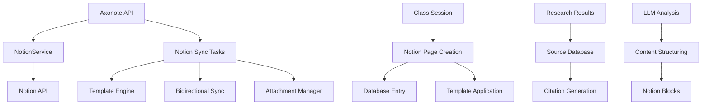

# B8.1 - Fase 8: Integración Notion Completa

## 📋 Resumen

La **Fase 8** implementa una integración completa y robusta con Notion, transformando Axonote en un sistema que no solo procesa y analiza contenido médico, sino que también lo sincroniza automáticamente con espacios de trabajo Notion estructurados. Esta fase crea un flujo completo desde la transcripción hasta la documentación organizada en Notion, con templates especializados, sincronización bidireccional y gestión automática de attachments.

## 🎯 Objetivos

### **Objetivo Principal**
Implementar una integración completa con Notion que permita sincronización automática de todo el contenido procesado por Axonote, incluyendo transcripciones, análisis LLM, research médico y fuentes, organizándolo en un workspace estructurado y navegable.

### **Objetivos Específicos**

1. **Sincronización Automática Completa**
   - Sincronización automática de clases procesadas con Notion
   - Creación automática de páginas estructuradas con templates
   - Gestión de metadatos y referencias cruzadas
   - Update automático cuando el contenido cambia

2. **Sistema de Templates Avanzado**
   - Templates especializados para diferentes tipos de clases médicas
   - Estructuras predefinidas para transcripciones, análisis y research
   - Templates personalizables por especialidad médica
   - Sistema de bloques dinámicos según el contenido

3. **Gestión de Databases Notion**
   - Creación automática de databases estructuradas
   - Relaciones entre clases, profesores, términos y fuentes
   - Propiedades personalizadas y filtros automáticos
   - Sistema de tags y categorización inteligente

4. **Sincronización Bidireccional**
   - Detección de cambios en Notion y sincronización de vuelta
   - Gestión de conflictos y versionado
   - Validación de integridad de datos
   - Merge inteligente de contenido modificado

5. **Gestión de Multimedia y Attachments**
   - Upload automático de archivos de audio a Notion
   - Gestión de imágenes y documentos relacionados
   - Integración con MinIO para storage híbrido
   - Optimización de attachments para Notion

6. **Dashboard y Métricas en Notion**
   - Dashboard automático con métricas de clases
   - Estadísticas de research y calidad de transcripciones
   - Progreso de procesamiento en tiempo real
   - Reportes automáticos de performance

## 🏗️ Implementación

### **Arquitectura del Sistema**



### **Componentes Principales**

#### **1. NotionService Expandido**
```python
class NotionService(BaseService):
    """Servicio completo de integración con Notion."""
    
    # Gestión de páginas
    async def create_class_page(self, class_data: Dict) -> str
    async def update_class_page(self, page_id: str, updates: Dict) -> bool
    async def delete_class_page(self, page_id: str) -> bool
    async def get_page_content(self, page_id: str) -> Dict
    
    # Gestión de databases
    async def ensure_databases_exist(self) -> Dict[str, str]
    async def create_database_entry(self, db_id: str, properties: Dict) -> str
    async def update_database_entry(self, page_id: str, properties: Dict) -> bool
    async def query_database(self, db_id: str, filters: Dict) -> List[Dict]
    
    # Templates y estructuras
    async def apply_template(self, page_id: str, template_type: str, data: Dict) -> bool
    async def create_block_content(self, blocks: List[Dict]) -> List[Dict]
    async def append_blocks(self, page_id: str, blocks: List[Dict]) -> bool
    
    # Sincronización bidireccional
    async def sync_from_notion(self, page_id: str) -> Dict
    async def detect_changes(self, page_id: str) -> Dict
    async def merge_changes(self, local_data: Dict, notion_data: Dict) -> Dict
    
    # Gestión de attachments
    async def upload_attachment(self, file_path: str, page_id: str) -> str
    async def manage_multimedia(self, class_id: str, assets: List[str]) -> Dict
```

#### **2. Sistema de Templates**
```python
class NotionTemplateManager:
    """Gestor de templates para diferentes tipos de contenido."""
    
    TEMPLATES = {
        "clase_magistral": ClasseMagistraleTemplate,
        "seminario_clinico": SeminarioClinicoTemplate,
        "caso_clinico": CasoClinicoTemplate,
        "conferencia": ConferenciaTemplate,
        "workshop": WorkshopTemplate
    }
    
    def get_template(self, template_type: str) -> BaseTemplate
    def apply_template(self, data: Dict, template_type: str) -> Dict
    def generate_blocks(self, content: Dict, template: BaseTemplate) -> List[Dict]
```

#### **3. Modelos de Sincronización**
```python
class NotionSyncRecord(Base):
    """Registro de sincronización con Notion."""
    
    id: UUID
    class_session_id: UUID  # FK a ClassSession
    notion_page_id: str
    notion_database_id: str
    sync_status: NotionSyncStatus
    last_sync_at: datetime
    last_notion_update: Optional[datetime]
    sync_metadata: Dict[str, Any]
    error_count: int
    error_details: Optional[str]
    
class NotionWorkspace(Base):
    """Configuración de workspace Notion."""
    
    id: UUID
    workspace_name: str
    notion_workspace_id: str
    database_ids: Dict[str, str]  # tipo -> database_id
    template_configs: Dict[str, Any]
    sync_settings: Dict[str, Any]
    is_active: bool
    created_at: datetime
```

#### **4. Tareas Celery Avanzadas**
```python
@celery_app.task(bind=True, name="notion.full_sync_class")
def full_sync_class_task(self, class_session_id: str, sync_options: Dict = None)

@celery_app.task(bind=True, name="notion.bidirectional_sync")
def bidirectional_sync_task(self, page_id: str)

@celery_app.task(bind=True, name="notion.sync_research_results")  
def sync_research_results_task(self, research_job_id: str)

@celery_app.task(bind=True, name="notion.manage_attachments")
def manage_attachments_task(self, class_session_id: str)

@celery_app.task(bind=True, name="notion.workspace_maintenance")
def workspace_maintenance_task(self, workspace_id: str)
```

### **Templates Especializados**

#### **Template: Clase Magistral**
```python
class ClasseMagistraleTemplate(BaseTemplate):
    """Template para clases magistrales tradicionales."""
    
    def get_page_structure(self, data: Dict) -> Dict:
        return {
            "title": f"🎓 {data['subject']} - {data['topic']}",
            "properties": {
                "Profesor": {"title": [{"text": {"content": data["professor_name"]}}]},
                "Materia": {"select": {"name": data["subject"]}},
                "Fecha": {"date": {"start": data["date"]}},
                "Duración": {"number": data["duration_minutes"]},
                "Estado": {"select": {"name": "Procesado"}},
                "Calidad": {"select": {"name": self._get_quality_level(data)}},
                "Tags": {"multi_select": self._generate_tags(data)}
            },
            "children": [
                self._create_header_block(data),
                self._create_summary_block(data),
                self._create_transcription_block(data),
                self._create_analysis_block(data),
                self._create_research_block(data),
                self._create_attachments_block(data)
            ]
        }
    
    def _create_header_block(self, data: Dict) -> Dict:
        """Crear bloque de cabecera con información de la clase."""
        return {
            "object": "block",
            "type": "callout",
            "callout": {
                "rich_text": [
                    {
                        "type": "text",
                        "text": {
                            "content": f"📊 Duración: {data['duration_minutes']} min | "
                                     f"👥 Participantes: {data.get('speaker_count', 1)} | "
                                     f"🎯 Calidad: {self._get_quality_level(data)}"
                        }
                    }
                ],
                "icon": {"emoji": "ℹ️"},
                "color": "blue_background"
            }
        }
    
    def _create_summary_block(self, data: Dict) -> Dict:
        """Crear bloque de resumen ejecutivo."""
        summary = data.get("llm_analysis", {}).get("summary", "")
        key_concepts = data.get("llm_analysis", {}).get("key_concepts", [])
        
        return {
            "object": "block",
            "type": "toggle",
            "toggle": {
                "rich_text": [{"type": "text", "text": {"content": "📋 Resumen Ejecutivo"}}],
                "children": [
                    {
                        "object": "block",
                        "type": "paragraph",
                        "paragraph": {
                            "rich_text": [{"type": "text", "text": {"content": summary}}]
                        }
                    },
                    {
                        "object": "block", 
                        "type": "bulleted_list_item",
                        "bulleted_list_item": {
                            "rich_text": [{"type": "text", "text": {"content": "🔑 Conceptos Clave:"}}]
                        }
                    }
                ] + [
                    {
                        "object": "block",
                        "type": "bulleted_list_item", 
                        "bulleted_list_item": {
                            "rich_text": [{"type": "text", "text": {"content": concept}}]
                        }
                    } for concept in key_concepts[:5]
                ]
            }
        }
```

#### **Template: Caso Clínico**
```python
class CasoClinicoTemplate(BaseTemplate):
    """Template especializado para casos clínicos."""
    
    def get_page_structure(self, data: Dict) -> Dict:
        return {
            "title": f"🏥 Caso Clínico - {data['topic']}",
            "properties": {
                "Especialidad": {"select": {"name": data.get("specialty", "General")}},
                "Complejidad": {"select": {"name": self._assess_complexity(data)}},
                "Diagnóstico Principal": {"rich_text": [{"text": {"content": data.get("main_diagnosis", "")}}]},
                "Procedimientos": {"multi_select": self._extract_procedures(data)},
                "Medicamentos": {"multi_select": self._extract_medications(data)}
            },
            "children": [
                self._create_case_header(data),
                self._create_anamnesis_block(data),
                self._create_examination_block(data),
                self._create_diagnosis_block(data),
                self._create_treatment_block(data),
                self._create_evolution_block(data),
                self._create_references_block(data)
            ]
        }
```

### **Sincronización Bidireccional**

#### **Detector de Cambios**
```python
class NotionChangeDetector:
    """Detecta y procesa cambios en páginas Notion."""
    
    async def detect_page_changes(self, page_id: str) -> Dict[str, Any]:
        """Detectar cambios en una página desde la última sincronización."""
        
        # Obtener última versión conocida
        sync_record = await self._get_sync_record(page_id)
        last_sync = sync_record.last_notion_update if sync_record else None
        
        # Obtener versión actual de Notion
        current_page = await self.notion_service.get_page_content(page_id)
        current_update = current_page.get("last_edited_time")
        
        if not last_sync or current_update > last_sync:
            # Hay cambios, analizar diferencias
            changes = await self._analyze_changes(sync_record, current_page)
            return {
                "has_changes": True,
                "changes": changes,
                "last_update": current_update,
                "sync_required": self._should_sync_back(changes)
            }
        
        return {"has_changes": False}
    
    async def _analyze_changes(self, sync_record: NotionSyncRecord, current_page: Dict) -> Dict:
        """Analizar tipos de cambios detectados."""
        changes = {
            "properties_changed": [],
            "content_modified": False,
            "blocks_added": [],
            "blocks_removed": [],
            "blocks_modified": []
        }
        
        # Analizar cambios en propiedades
        if sync_record and sync_record.sync_metadata:
            old_properties = sync_record.sync_metadata.get("properties", {})
            new_properties = current_page.get("properties", {})
            
            for key, new_value in new_properties.items():
                old_value = old_properties.get(key)
                if old_value != new_value:
                    changes["properties_changed"].append({
                        "property": key,
                        "old_value": old_value,
                        "new_value": new_value
                    })
        
        # Analizar cambios en contenido (simplificado)
        # En implementación real, comparar estructuras de bloques
        changes["content_modified"] = True  # Por ahora, asumir cambios
        
        return changes
```

#### **Merge Inteligente**
```python
class NotionContentMerger:
    """Gestor de merge de contenido modificado."""
    
    async def merge_notion_changes(
        self, 
        class_session_id: UUID, 
        notion_changes: Dict
    ) -> Dict[str, Any]:
        """Hacer merge de cambios de Notion con datos locales."""
        
        # Obtener datos locales actuales
        class_session = await self._get_class_session(class_session_id)
        
        merge_result = {
            "conflicts": [],
            "auto_merged": [],
            "manual_review_required": [],
            "local_updates": {}
        }
        
        # Procesar cambios en propiedades
        for prop_change in notion_changes.get("properties_changed", []):
            merge_decision = await self._merge_property_change(
                class_session, prop_change
            )
            
            if merge_decision["status"] == "auto_merged":
                merge_result["auto_merged"].append(merge_decision)
                merge_result["local_updates"][prop_change["property"]] = merge_decision["new_value"]
                
            elif merge_decision["status"] == "conflict":
                merge_result["conflicts"].append(merge_decision)
                
            elif merge_decision["status"] == "manual_review":
                merge_result["manual_review_required"].append(merge_decision)
        
        # Si hay conflictos, crear entrada de revisión manual
        if merge_result["conflicts"] or merge_result["manual_review_required"]:
            await self._create_conflict_resolution_task(class_session_id, merge_result)
        
        # Aplicar cambios auto-merged
        if merge_result["local_updates"]:
            await self._apply_local_updates(class_session, merge_result["local_updates"])
        
        return merge_result
```

### **Gestión de Attachments**

#### **Manager de Multimedia**
```python
class NotionAttachmentManager:
    """Gestión de archivos multimedia en Notion."""
    
    async def sync_class_attachments(self, class_session_id: UUID, page_id: str) -> Dict:
        """Sincronizar todos los attachments de una clase."""
        
        result = {
            "audio_files": [],
            "images": [],
            "documents": [],
            "errors": []
        }
        
        try:
            # Obtener archivos de audio originales
            audio_files = await self._get_audio_files(class_session_id)
            for audio_file in audio_files:
                upload_result = await self._upload_audio_to_notion(audio_file, page_id)
                result["audio_files"].append(upload_result)
            
            # Procesar imágenes generadas (si existen)
            images = await self._get_generated_images(class_session_id)
            for image in images:
                upload_result = await self._upload_image_to_notion(image, page_id)
                result["images"].append(upload_result)
            
            # Procesar documentos exportados
            documents = await self._get_exported_documents(class_session_id)
            for doc in documents:
                upload_result = await self._upload_document_to_notion(doc, page_id)
                result["documents"].append(upload_result)
                
        except Exception as e:
            result["errors"].append(str(e))
        
        return result
    
    async def _upload_audio_to_notion(self, audio_file: Dict, page_id: str) -> Dict:
        """Subir archivo de audio a Notion."""
        
        # Verificar tamaño (Notion tiene límites)
        if audio_file["size"] > 50 * 1024 * 1024:  # 50MB
            # Para archivos grandes, crear enlace a MinIO
            return await self._create_minio_link(audio_file, page_id)
        
        # Para archivos pequeños, upload directo
        try:
            # Obtener archivo de MinIO
            file_content = await self.minio_service.get_file(audio_file["path"])
            
            # Upload a Notion
            upload_result = await self.notion_service.upload_file(
                file_content=file_content,
                filename=audio_file["filename"],
                page_id=page_id
            )
            
            return {
                "type": "audio",
                "filename": audio_file["filename"],
                "notion_url": upload_result["url"],
                "status": "uploaded"
            }
            
        except Exception as e:
            return {
                "type": "audio",
                "filename": audio_file["filename"],
                "error": str(e),
                "status": "failed"
            }
```

### **Dashboard y Métricas**

#### **Generador de Dashboard**
```python
class NotionDashboardGenerator:
    """Genera dashboards automáticos en Notion."""
    
    async def create_main_dashboard(self, workspace_id: str) -> str:
        """Crear dashboard principal con métricas generales."""
        
        # Recopilar estadísticas
        stats = await self._gather_workspace_stats(workspace_id)
        
        dashboard_content = {
            "title": "📊 Axonote Dashboard",
            "children": [
                self._create_stats_overview(stats),
                self._create_recent_classes(stats),
                self._create_quality_metrics(stats),
                self._create_research_summary(stats),
                self._create_sync_status(stats)
            ]
        }
        
        # Crear página en Notion
        page_id = await self.notion_service.create_page(dashboard_content)
        
        # Programar actualización automática
        await self._schedule_dashboard_updates(page_id)
        
        return page_id
    
    def _create_stats_overview(self, stats: Dict) -> Dict:
        """Crear bloque de estadísticas generales."""
        return {
            "object": "block",
            "type": "column_list",
            "column_list": {
                "children": [
                    {
                        "object": "block",
                        "type": "column",
                        "column": {
                            "children": [
                                {
                                    "object": "block",
                                    "type": "callout",
                                    "callout": {
                                        "rich_text": [
                                            {
                                                "type": "text",
                                                "text": {
                                                    "content": f"🎓 {stats['total_classes']}\nClases Procesadas"
                                                }
                                            }
                                        ],
                                        "icon": {"emoji": "📊"},
                                        "color": "blue_background"
                                    }
                                }
                            ]
                        }
                    },
                    {
                        "object": "block", 
                        "type": "column",
                        "column": {
                            "children": [
                                {
                                    "object": "block",
                                    "type": "callout",
                                    "callout": {
                                        "rich_text": [
                                            {
                                                "type": "text",
                                                "text": {
                                                    "content": f"⏱️ {stats['total_hours']:.1f}h\nHoras de Audio"
                                                }
                                            }
                                        ],
                                        "icon": {"emoji": "🎵"},
                                        "color": "green_background"
                                    }
                                }
                            ]
                        }
                    },
                    {
                        "object": "block",
                        "type": "column", 
                        "column": {
                            "children": [
                                {
                                    "object": "block",
                                    "type": "callout",
                                    "callout": {
                                        "rich_text": [
                                            {
                                                "type": "text",
                                                "text": {
                                                    "content": f"🔬 {stats['research_terms']}\nTérminos Investigados"
                                                }
                                            }
                                        ],
                                        "icon": {"emoji": "🧬"},
                                        "color": "purple_background"
                                    }
                                }
                            ]
                        }
                    }
                ]
            }
        }
```

### **Configuración Expandida**

#### **Nuevas Variables de Entorno**
```bash
# ================================================
# NOTION INTEGRACIÓN COMPLETA - FASE 8
# ================================================

# Configuración Básica
NOTION_TOKEN=secret_xxxxxxxxxx                    # Token de integración Notion (requerido)
NOTION_VERSION=2022-06-28                         # Versión API Notion (opcional)

# Workspaces y Databases
NOTION_WORKSPACE_ID=                              # ID del workspace principal (opcional)
NOTION_DB_CLASSES=                               # Database ID para clases
NOTION_DB_SOURCES=                               # Database ID para fuentes médicas  
NOTION_DB_TERMS=                                 # Database ID para términos
NOTION_DB_CARDS=                                 # Database ID para cards de estudio
NOTION_DB_PROFESSORS=                            # Database ID para profesores
NOTION_DB_RESEARCH=                              # Database ID para research jobs

# Sincronización Automática
NOTION_AUTO_SYNC_ENABLED=true                   # Habilitar sync automático
NOTION_SYNC_ON_COMPLETION=true                  # Sync al completar procesamiento
NOTION_SYNC_INTERVAL_MINUTES=15                 # Intervalo de sync bidireccional
NOTION_BATCH_SYNC_SIZE=10                       # Número de elementos por batch

# Templates y Estructuras
NOTION_DEFAULT_TEMPLATE=clase_magistral         # Template por defecto
NOTION_AUTO_DETECT_TEMPLATE=true               # Detección automática de template
NOTION_CUSTOM_TEMPLATES_PATH=data/notion_templates/  # Directorio de templates custom
NOTION_TEMPLATE_VALIDATION=strict              # Validación de templates (strict/loose)

# Gestión de Contenido
NOTION_MAX_PAGE_SIZE_MB=50                      # Tamaño máximo de página
NOTION_MAX_BLOCKS_PER_PAGE=2000                # Límite de bloques por página
NOTION_CONTENT_TRUNCATION=smart                # Truncado inteligente (smart/hard/none)
NOTION_PRESERVE_FORMATTING=true                # Preservar formato de transcripciones

# Attachments y Multimedia
NOTION_UPLOAD_ATTACHMENTS=true                 # Subir attachments automáticamente
NOTION_MAX_ATTACHMENT_SIZE_MB=50               # Tamaño máximo de attachment
NOTION_ATTACHMENT_STORAGE=hybrid               # Estrategia storage (notion/minio/hybrid)
NOTION_COMPRESS_AUDIO=true                     # Comprimir audio antes de upload
NOTION_AUDIO_FORMAT=mp3                        # Formato de audio preferido

# Sincronización Bidireccional
NOTION_BIDIRECTIONAL_SYNC=true                 # Habilitar sync bidireccional
NOTION_CONFLICT_RESOLUTION=auto                # Resolución de conflictos (auto/manual/overwrite)
NOTION_CHANGE_DETECTION_INTERVAL=5             # Intervalo detección cambios (minutos)
NOTION_MERGE_STRATEGY=smart                    # Estrategia de merge (smart/overwrite/manual)

# Performance y Rate Limiting
NOTION_REQUESTS_PER_SECOND=3.0                 # Rate limit para API Notion
NOTION_CONCURRENT_UPLOADS=2                    # Uploads concurrentes
NOTION_RETRY_ATTEMPTS=3                        # Intentos de retry
NOTION_TIMEOUT_SECONDS=30                      # Timeout para requests
NOTION_CACHE_PAGES=true                        # Cache de páginas frecuentes

# Validación y Calidad
NOTION_VALIDATE_BEFORE_SYNC=true              # Validar antes de sincronizar
NOTION_CONTENT_QUALITY_CHECK=true             # Check de calidad de contenido
NOTION_DUPLICATE_DETECTION=true               # Detección de duplicados
NOTION_BACKUP_BEFORE_SYNC=true                # Backup antes de cambios importantes

# Notificaciones y Logs
NOTION_SYNC_NOTIFICATIONS=true                # Notificaciones de sync
NOTION_ERROR_NOTIFICATIONS=true               # Notificaciones de errores
NOTION_DETAILED_LOGGING=true                  # Logging detallado
NOTION_METRICS_COLLECTION=true                # Recolección de métricas

# Configuración Avanzada
NOTION_API_RETRIES_BACKOFF=exponential        # Backoff strategy (linear/exponential)
NOTION_PARALLEL_PROCESSING=true               # Procesamiento paralelo
NOTION_MEMORY_OPTIMIZATION=true               # Optimizaciones de memoria
NOTION_EXPERIMENTAL_FEATURES=false            # Features experimentales
```

## ✅ Checklist de Validación

### **Configuración Inicial**
- [ ] Token de Notion configurado y validado
- [ ] Workspace Notion creado y accesible
- [ ] Databases principales creados en Notion
- [ ] Relaciones entre databases configuradas
- [ ] Permisos de integración configurados correctamente

### **Templates y Estructuras**
- [ ] Templates base implementados y probados
- [ ] Detección automática de tipo de clase funcionando
- [ ] Generación de bloques Notion correcta
- [ ] Formato de contenido preservado
- [ ] Metadatos y propiedades sincronizados

### **Sincronización Completa**
- [ ] Sincronización automática al completar procesamiento
- [ ] Creación correcta de páginas estructuradas
- [ ] Upload de attachments funcionando
- [ ] Referencias cruzadas establecidas
- [ ] Gestión de errores robusta

### **Sincronización Bidireccional**
- [ ] Detección de cambios en Notion
- [ ] Merge inteligente sin pérdida de datos
- [ ] Resolución automática de conflictos
- [ ] Validación de integridad post-merge
- [ ] Backup automático antes de cambios

### **Performance y Calidad**
- [ ] Rate limiting respetado (3 req/s)
- [ ] Tiempo de sincronización < 2 minutos para clases típicas
- [ ] Manejo correcto de archivos grandes
- [ ] Cache de páginas funcionando
- [ ] Métricas de performance recolectadas

### **APIs REST**
- [ ] Endpoints de gestión Notion funcionando
- [ ] Monitoreo de sync en tiempo real
- [ ] Trigger manual de sincronización
- [ ] Health check completo
- [ ] Documentación automática actualizada

### **Testing Completo**
- [ ] Suite de tests implementada y pasando
- [ ] Tests de integración con Notion API
- [ ] Tests de templates y generación de contenido
- [ ] Tests de sincronización bidireccional
- [ ] Tests de manejo de errores y edge cases

## 🔧 Troubleshooting

### **Problemas Comunes**

#### **Error de Autenticación**
```bash
# Verificar token Notion
curl -H "Authorization: Bearer $NOTION_TOKEN" \
     -H "Notion-Version: 2022-06-28" \
     https://api.notion.com/v1/users/me

# Verificar permisos de integración
curl -H "Authorization: Bearer $NOTION_TOKEN" \
     -H "Notion-Version: 2022-06-28" \
     https://api.notion.com/v1/databases/$NOTION_DB_CLASSES
```

#### **Rate Limiting**
```python
# En logs buscar:
[WARNING] Notion rate limit hit, backing off for 10 seconds
[ERROR] Notion API error 429: rate_limited

# Solución: Reducir NOTION_REQUESTS_PER_SECOND
NOTION_REQUESTS_PER_SECOND=2.0  # Reducir de 3.0 a 2.0
```

#### **Páginas Grandes**
```python
# Error: Page too large
[ERROR] Notion page exceeds 2000 blocks limit

# Solución: Habilitar truncado inteligente
NOTION_CONTENT_TRUNCATION=smart
NOTION_MAX_BLOCKS_PER_PAGE=1500
```

#### **Attachments Fallidos**
```python
# Error: Attachment upload failed
[ERROR] Notion attachment upload failed: file too large

# Solución: Usar storage híbrido
NOTION_ATTACHMENT_STORAGE=hybrid
NOTION_MAX_ATTACHMENT_SIZE_MB=25
```

### **Comandos de Debugging**

```bash
# Health check completo
curl http://localhost:8000/api/v1/notion/health

# Verificar configuración
curl http://localhost:8000/api/v1/notion/config

# Estado de sincronización
curl http://localhost:8000/api/v1/notion/sync/status

# Métricas de performance
curl http://localhost:8000/api/v1/notion/metrics

# Logs de Notion en tiempo real
docker logs -f axonote-api | grep "notion"
```

## 📊 Métricas

### **Performance Target**
| Métrica | Target | Descripción |
|---------|--------|-------------|
| **Sync Time** | < 2 min | Tiempo total de sincronización completa |
| **Rate Limit** | 3 req/s | Respeto de límites API Notion |
| **Success Rate** | > 99% | Porcentaje de sincronizaciones exitosas |
| **Attachment Upload** | < 30 seg | Tiempo upload de archivos multimedia |
| **Change Detection** | < 5 min | Tiempo detección de cambios bidireccionales |

### **Métricas de Calidad**
| Métrica | Target | Descripción |
|---------|--------|-------------|
| **Template Match** | > 95% | Precisión en detección automática de templates |
| **Content Integrity** | 100% | Preservación de contenido sin pérdidas |
| **Reference Accuracy** | > 98% | Precisión en referencias cruzadas |
| **Conflict Resolution** | > 90% | Resolución automática exitosa de conflictos |
| **User Satisfaction** | > 4.5/5 | Satisfacción con integración Notion |

## 🚀 Próximos Pasos

Una vez completada la **Fase 8**, el sistema Axonote tendrá integración completa con Notion, permitiendo flujos de trabajo completamente automatizados desde grabación hasta documentación estructurada. 

### **Fase 9: OCR y Micro-Memos**
- Procesamiento de documentos e imágenes médicas
- Generación de micro-memos automáticos
- Integración OCR con contenido Notion
- Sistema de cards de estudio inteligentes

**Tiempo estimado**: 4-5 días de desarrollo

### **Integración Continua**
La Fase 8 proporciona la base para todas las fases posteriores, ya que todas las nuevas funcionalidades (OCR, TTS, exports, métricas) se sincronizarán automáticamente con Notion, creando un ecosystem completo de conocimiento médico.

---

**🎯 Resultado Esperado**: Sistema completo de sincronización Notion que transforma Axonote en una plataforma integral de gestión de conocimiento médico, con workflows automatizados desde la grabación hasta la documentación estructurada en espacios de trabajo colaborativos.

**📈 Impacto**: Eliminación de trabajo manual de documentación, creación automática de bases de conocimiento estructuradas, y establecimiento de Axonote como herramienta integral de productividad para educación médica.
