# B9.1 - Fase 9: OCR y Micro-Memos

## 📋 Resumen de la Fase

La **Fase 9** implementa capacidades avanzadas de OCR (Optical Character Recognition) y generación automática de micro-memos, transformando Axonote en una plataforma completa de gestión de conocimiento médico que puede procesar no solo audio sino también imágenes, documentos y generar contenido de estudio personalizado.

### 🎯 Objetivos Principales

1. **Sistema OCR Médico Completo** - Procesamiento de imágenes médicas, diapositivas y documentos
2. **Generación Automática de Micro-Memos** - Flashcards y tarjetas de estudio desde contenido procesado
3. **Integración Multi-Modal** - Combinar transcripciones, OCR y research en contenido unificado
4. **Sincronización Notion Extendida** - Templates especializados para contenido OCR y micro-memos
5. **Workflow Automatizado** - Pipeline completo desde documento hasta micro-memos listos para estudio

## 🏗️ Arquitectura de la Solución

### **Pipeline OCR Multi-Modal**

```mermaid
graph TD
    A[Documento/Imagen] --> B[Detección de Tipo]
    B --> C{Tipo de Contenido}
    C -->|PDF Médico| D[Extracción PDF + OCR]
    C -->|Imagen/Slide| E[Procesamiento Imagen]
    C -->|Diagrama Médico| F[OCR Especializado]
    
    D --> G[Post-procesamiento Médico]
    E --> G
    F --> G
    
    G --> H[Validación Terminología]
    H --> I[Generación Micro-Memos]
    I --> J[Sincronización Notion]
    J --> K[Cards de Estudio]
```



### **Generación Inteligente de Micro-Memos**

```mermaid
graph TD
    A[Contenido Procesado] --> B[Análisis de Contexto]
    B --> C[Extracción de Conceptos]
    C --> D[Clasificación por Dificultad]
    D --> E{Tipo de Memo}
    
    E -->|Definición| F[Card Definición]
    E -->|Concepto| G[Card Concepto-Explicación]
    E -->|Proceso| H[Card Proceso-Pasos]
    E -->|Diagnóstico| I[Card Caso-Diagnóstico]
    
    F --> J[Validación LLM]
    G --> J
    H --> J
    I --> J
    
    J --> K[Formato Final]
    K --> L[Sincronización]
```



## 🎯 Componentes Técnicos

### **1. Modelos de Base de Datos**

#### **OCRResult**
```python
class OCRResult(Base):
    __tablename__ = "ocr_results"
    
    id: Mapped[uuid.UUID] = mapped_column(UUID, primary_key=True, default=uuid.uuid4)
    class_session_id: Mapped[uuid.UUID] = mapped_column(UUID, ForeignKey("class_sessions.id"))
    
    # Metadatos del archivo fuente
    source_file_id: Mapped[str] = mapped_column(String, nullable=False)  # MinIO object key
    source_filename: Mapped[str] = mapped_column(String, nullable=False)
    source_type: Mapped[str] = mapped_column(String, nullable=False)  # pdf, image, slide
    file_size: Mapped[int] = mapped_column(Integer, nullable=False)
    mime_type: Mapped[str] = mapped_column(String, nullable=False)
    
    # Configuración de procesamiento
    ocr_engine: Mapped[str] = mapped_column(String, default="tesseract")  # tesseract, easyocr, custom
    language: Mapped[str] = mapped_column(String, default="ita")
    confidence_threshold: Mapped[float] = mapped_column(Float, default=0.7)
    
    # Resultados OCR
    extracted_text: Mapped[str] = mapped_column(Text, nullable=True)
    raw_ocr_data: Mapped[dict] = mapped_column(JSON, nullable=True)  # Datos completos del OCR
    confidence_score: Mapped[float] = mapped_column(Float, nullable=True)
    
    # Análisis de contenido
    detected_language: Mapped[str] = mapped_column(String, nullable=True)
    content_type: Mapped[str] = mapped_column(String, nullable=True)  # medical_diagram, text_slide, mixed, etc.
    medical_terms_detected: Mapped[list] = mapped_column(JSON, default_factory=list)
    
    # Procesamiento y validación
    is_medical_content: Mapped[bool] = mapped_column(Boolean, default=False)
    requires_review: Mapped[bool] = mapped_column(Boolean, default=False)
    review_notes: Mapped[str] = mapped_column(Text, nullable=True)
    
    # Performance y métricas
    processing_time: Mapped[float] = mapped_column(Float, nullable=True)
    pages_processed: Mapped[int] = mapped_column(Integer, default=1)
    
    # Timestamps
    created_at: Mapped[datetime] = mapped_column(DateTime, default=datetime.utcnow)
    updated_at: Mapped[datetime] = mapped_column(DateTime, default=datetime.utcnow, onupdate=datetime.utcnow)
    
    # Relaciones
    class_session: Mapped["ClassSession"] = relationship("ClassSession", back_populates="ocr_results")
    micro_memos: Mapped[list["MicroMemo"]] = relationship("MicroMemo", back_populates="source_ocr")
```

#### **MicroMemo**
```python
class MicroMemo(Base):
    __tablename__ = "micro_memos"
    
    id: Mapped[uuid.UUID] = mapped_column(UUID, primary_key=True, default=uuid.uuid4)
    class_session_id: Mapped[uuid.UUID] = mapped_column(UUID, ForeignKey("class_sessions.id"))
    
    # Fuente del micro-memo
    source_type: Mapped[str] = mapped_column(String, nullable=False)  # transcription, ocr, research, manual
    source_ocr_id: Mapped[uuid.UUID] = mapped_column(UUID, ForeignKey("ocr_results.id"), nullable=True)
    source_llm_analysis_id: Mapped[uuid.UUID] = mapped_column(UUID, ForeignKey("llm_analysis_results.id"), nullable=True)
    source_research_id: Mapped[uuid.UUID] = mapped_column(UUID, ForeignKey("research_results.id"), nullable=True)
    
    # Contenido del micro-memo
    title: Mapped[str] = mapped_column(String, nullable=False)
    question: Mapped[str] = mapped_column(Text, nullable=False)
    answer: Mapped[str] = mapped_column(Text, nullable=False)
    explanation: Mapped[str] = mapped_column(Text, nullable=True)
    
    # Clasificación y metadatos
    memo_type: Mapped[str] = mapped_column(String, nullable=False)  # definition, concept, process, case, fact
    difficulty_level: Mapped[str] = mapped_column(String, default="medium")  # easy, medium, hard, expert
    medical_specialty: Mapped[str] = mapped_column(String, nullable=True)
    tags: Mapped[list] = mapped_column(JSON, default_factory=list)
    
    # Referencias y contexto
    context_snippet: Mapped[str] = mapped_column(Text, nullable=True)  # Fragmento de contexto original
    related_terms: Mapped[list] = mapped_column(JSON, default_factory=list)
    references: Mapped[list] = mapped_column(JSON, default_factory=list)
    
    # Sistema de estudio
    study_priority: Mapped[int] = mapped_column(Integer, default=5)  # 1-10
    estimated_study_time: Mapped[int] = mapped_column(Integer, nullable=True)  # minutos
    
    # Validación y calidad
    confidence_score: Mapped[float] = mapped_column(Float, nullable=True)
    requires_review: Mapped[bool] = mapped_column(Boolean, default=False)
    is_validated: Mapped[bool] = mapped_column(Boolean, default=False)
    validation_notes: Mapped[str] = mapped_column(Text, nullable=True)
    
    # Performance tracking
    times_studied: Mapped[int] = mapped_column(Integer, default=0)
    times_correct: Mapped[int] = mapped_column(Integer, default=0)
    last_studied: Mapped[datetime] = mapped_column(DateTime, nullable=True)
    next_review: Mapped[datetime] = mapped_column(DateTime, nullable=True)
    
    # Timestamps
    created_at: Mapped[datetime] = mapped_column(DateTime, default=datetime.utcnow)
    updated_at: Mapped[datetime] = mapped_column(DateTime, default=datetime.utcnow, onupdate=datetime.utcnow)
    
    # Relaciones
    class_session: Mapped["ClassSession"] = relationship("ClassSession", back_populates="micro_memos")
    source_ocr: Mapped["OCRResult"] = relationship("OCRResult", back_populates="micro_memos")
    source_llm_analysis: Mapped["LLMAnalysisResult"] = relationship("LLMAnalysisResult", back_populates="micro_memos")
    source_research: Mapped["ResearchResult"] = relationship("ResearchResult", back_populates="micro_memos")
```

#### **MicroMemoCollection**
```python
class MicroMemoCollection(Base):
    __tablename__ = "micro_memo_collections"
    
    id: Mapped[uuid.UUID] = mapped_column(UUID, primary_key=True, default=uuid.uuid4)
    
    # Metadatos de colección
    name: Mapped[str] = mapped_column(String, nullable=False)
    description: Mapped[str] = mapped_column(Text, nullable=True)
    collection_type: Mapped[str] = mapped_column(String, default="custom")  # auto, custom, specialty, exam
    
    # Filtros y reglas
    auto_include_criteria: Mapped[dict] = mapped_column(JSON, nullable=True)
    tags_included: Mapped[list] = mapped_column(JSON, default_factory=list)
    difficulty_range: Mapped[dict] = mapped_column(JSON, nullable=True)  # {"min": "easy", "max": "hard"}
    specialty_filter: Mapped[str] = mapped_column(String, nullable=True)
    
    # Configuración de estudio
    study_mode: Mapped[str] = mapped_column(String, default="mixed")  # sequential, random, spaced
    max_memos_per_session: Mapped[int] = mapped_column(Integer, default=20)
    enable_spaced_repetition: Mapped[bool] = mapped_column(Boolean, default=True)
    
    # Métricas y tracking
    total_memos: Mapped[int] = mapped_column(Integer, default=0)
    completion_rate: Mapped[float] = mapped_column(Float, default=0.0)
    avg_accuracy: Mapped[float] = mapped_column(Float, default=0.0)
    
    # Timestamps
    created_at: Mapped[datetime] = mapped_column(DateTime, default=datetime.utcnow)
    updated_at: Mapped[datetime] = mapped_column(DateTime, default=datetime.utcnow, onupdate=datetime.utcnow)
    last_studied: Mapped[datetime] = mapped_column(DateTime, nullable=True)
    
    # Relación many-to-many con MicroMemo
    memos: Mapped[list["MicroMemo"]] = relationship(
        "MicroMemo", 
        secondary="micro_memo_collection_items",
        back_populates="collections"
    )
```

### **2. Servicios Core**

#### **OCRService**
```python
class OCRService:
    """Servicio completo de OCR para contenido médico"""
    
    def __init__(self):
        self.config = get_settings()
        self.tesseract_configs = {
            "medical_text": "--oem 3 --psm 6 -c tessedit_char_whitelist=ABCDEFGHIJKLMNOPQRSTUVWXYZabcdefghijklmnopqrstuvwxyz0123456789àáèéìíîòóùúüÀÁÈÉÌÍÎÒÓÙÚÜ.,;:()[]{}/-_ ",
            "medical_diagram": "--oem 3 --psm 6",
            "presentation_slide": "--oem 3 --psm 3",
            "mixed_content": "--oem 3 --psm 6"
        }
        self.medical_terms_cache = {}
    
    async def process_document(
        self, 
        file_key: str, 
        class_session_id: uuid.UUID,
        ocr_config: Optional[dict] = None
    ) -> OCRResult:
        """Procesa un documento completo con OCR"""
        
        # 1. Obtener archivo desde MinIO
        file_data = await self.minio_service.get_file(file_key)
        
        # 2. Detectar tipo de contenido
        content_type = await self._detect_content_type(file_data, file_key)
        
        # 3. Preparar configuración OCR
        config = await self._prepare_ocr_config(content_type, ocr_config)
        
        # 4. Ejecutar OCR según tipo
        if content_type == "pdf":
            ocr_data = await self._process_pdf(file_data, config)
        elif content_type in ["image", "slide"]:
            ocr_data = await self._process_image(file_data, config)
        else:
            raise ValueError(f"Tipo de contenido no soportado: {content_type}")
        
        # 5. Post-procesamiento médico
        processed_data = await self._medical_postprocessing(ocr_data)
        
        # 6. Crear registro en BD
        ocr_result = await self._save_ocr_result(
            class_session_id=class_session_id,
            file_key=file_key,
            ocr_data=processed_data,
            config=config
        )
        
        # 7. Trigger generación de micro-memos
        if self.config.AUTO_GENERATE_MICROMEMOS:
            await self._trigger_micromemo_generation(ocr_result.id)
        
        return ocr_result
    
    async def _process_pdf(self, file_data: bytes, config: dict) -> dict:
        """Procesa PDF médico con OCR"""
        
        # Convertir PDF a imágenes
        images = await self._pdf_to_images(file_data)
        
        all_text = []
        all_confidence = []
        pages_data = []
        
        for page_num, image in enumerate(images):
            # OCR por página
            page_result = await self._ocr_image(image, config)
            
            pages_data.append({
                "page": page_num + 1,
                "text": page_result["text"],
                "confidence": page_result["confidence"],
                "word_boxes": page_result.get("word_boxes", []),
                "detected_elements": page_result.get("detected_elements", [])
            })
            
            all_text.append(page_result["text"])
            all_confidence.append(page_result["confidence"])
        
        return {
            "full_text": "\n\n".join(all_text),
            "average_confidence": sum(all_confidence) / len(all_confidence),
            "pages_data": pages_data,
            "total_pages": len(images)
        }
    
    async def _process_image(self, file_data: bytes, config: dict) -> dict:
        """Procesa imagen individual con OCR"""
        
        # Cargar imagen
        image = Image.open(BytesIO(file_data))
        
        # Pre-procesamiento de imagen
        processed_image = await self._preprocess_image(image, config)
        
        # OCR
        result = await self._ocr_image(processed_image, config)
        
        return {
            "full_text": result["text"],
            "average_confidence": result["confidence"],
            "pages_data": [result],
            "total_pages": 1
        }
    
    async def _medical_postprocessing(self, ocr_data: dict) -> dict:
        """Post-procesamiento específico para contenido médico"""
        
        text = ocr_data["full_text"]
        
        # 1. Corrección de términos médicos conocidos
        corrected_text = await self._correct_medical_terms(text)
        
        # 2. Detección de terminología médica
        medical_terms = await self._detect_medical_terminology(corrected_text)
        
        # 3. Análisis de tipo de contenido
        content_analysis = await self._analyze_content_type(corrected_text)
        
        # 4. Validación de calidad
        quality_score = await self._calculate_quality_score(ocr_data, content_analysis)
        
        return {
            **ocr_data,
            "corrected_text": corrected_text,
            "medical_terms": medical_terms,
            "content_analysis": content_analysis,
            "quality_score": quality_score,
            "requires_review": quality_score < 0.7
        }
```

#### **MicroMemoService**
```python
class MicroMemoService:
    """Servicio de generación automática de micro-memos"""
    
    def __init__(self):
        self.config = get_settings()
        self.llm_service = LLMService()
        self.content_analyzer = ContentAnalyzer()
        
        # Templates para diferentes tipos de micro-memos
        self.memo_templates = {
            "definition": {
                "system_prompt": "Crea una flashcard de definición médica clara y concisa.",
                "question_format": "¿Qué es {term}?",
                "difficulty_keywords": ["básico", "fundamental", "definición"]
            },
            "concept": {
                "system_prompt": "Crea una flashcard que explique un concepto médico complejo.",
                "question_format": "Explica el concepto de {concept}",
                "difficulty_keywords": ["explicar", "concepto", "mecanismo"]
            },
            "process": {
                "system_prompt": "Crea una flashcard sobre un proceso o procedimiento médico.",
                "question_format": "Describe el proceso de {process}",
                "difficulty_keywords": ["proceso", "procedimiento", "protocolo", "pasos"]
            },
            "case": {
                "system_prompt": "Crea una flashcard de caso clínico con diagnóstico.",
                "question_format": "Paciente con {symptoms}. ¿Cuál es el diagnóstico más probable?",
                "difficulty_keywords": ["caso", "paciente", "diagnóstico", "síntomas"]
            }
        }
    
    async def generate_from_ocr(self, ocr_result: OCRResult) -> list[MicroMemo]:
        """Genera micro-memos desde resultado OCR"""
        
        # 1. Analizar contenido OCR
        content_chunks = await self._chunk_ocr_content(ocr_result)
        
        # 2. Extraer conceptos clave
        key_concepts = await self._extract_key_concepts(content_chunks)
        
        # 3. Generar micro-memos por concepto
        memos = []
        for concept in key_concepts:
            memo_type = await self._classify_memo_type(concept)
            memo = await self._generate_memo(concept, memo_type, ocr_result)
            if memo:
                memos.append(memo)
        
        # 4. Validar y filtrar
        validated_memos = await self._validate_memos(memos)
        
        # 5. Guardar en BD
        saved_memos = []
        for memo_data in validated_memos:
            memo = await self._save_micro_memo(memo_data, ocr_result)
            saved_memos.append(memo)
        
        return saved_memos
    
    async def generate_from_transcription(
        self, 
        llm_analysis: LLMAnalysisResult
    ) -> list[MicroMemo]:
        """Genera micro-memos desde análisis LLM de transcripción"""
        
        # 1. Extraer contenido del análisis LLM
        content = llm_analysis.analysis_result
        
        # 2. Identificar puntos clave para memos
        key_points = await self._extract_memo_points(content)
        
        # 3. Generar memos focalizados
        memos = []
        for point in key_points:
            memo = await self._generate_focused_memo(point, llm_analysis)
            if memo:
                memos.append(memo)
        
        return await self._save_multiple_memos(memos)
    
    async def generate_collection(
        self, 
        class_session: ClassSession,
        collection_config: dict
    ) -> MicroMemoCollection:
        """Genera colección automática de micro-memos para una clase"""
        
        # 1. Recopilar todo el contenido procesado
        all_content = await self._gather_session_content(class_session)
        
        # 2. Analizar y priorizar conceptos
        prioritized_concepts = await self._prioritize_concepts(all_content)
        
        # 3. Generar set balanceado de memos
        memo_set = await self._generate_balanced_set(
            prioritized_concepts, 
            collection_config
        )
        
        # 4. Crear colección
        collection = await self._create_collection(
            class_session=class_session,
            memos=memo_set,
            config=collection_config
        )
        
        return collection
    
    async def _generate_memo(
        self, 
        concept: dict, 
        memo_type: str, 
        source: Union[OCRResult, LLMAnalysisResult]
    ) -> Optional[dict]:
        """Genera un micro-memo individual"""
        
        template = self.memo_templates[memo_type]
        
        # Preparar prompt para LLM
        prompt = f"""
        {template['system_prompt']}
        
        Contexto: {concept['context']}
        Concepto clave: {concept['term']}
        Tipo de contenido: {concept['content_type']}
        
        Genera una flashcard en formato JSON con:
        - question: Pregunta clara y específica
        - answer: Respuesta concisa pero completa
        - explanation: Explicación adicional si es necesario
        - difficulty: easy/medium/hard basado en complejidad
        - tags: lista de tags relevantes
        
        La flashcard debe ser adecuada para estudio médico en italiano.
        """
        
        # Llamar a LLM
        llm_response = await self.llm_service.generate_structured_content(
            prompt=prompt,
            expected_format="flashcard_json",
            max_tokens=500
        )
        
        if not llm_response or not llm_response.get("success"):
            return None
        
        memo_data = llm_response["content"]
        
        # Enriquecer con metadatos
        memo_data.update({
            "memo_type": memo_type,
            "source_concept": concept,
            "confidence_score": llm_response.get("confidence", 0.8),
            "context_snippet": concept.get("context", "")[:500],
            "medical_specialty": concept.get("specialty"),
            "estimated_study_time": self._estimate_study_time(memo_data)
        })
        
        return memo_data
    
    async def _validate_memos(self, memos: list[dict]) -> list[dict]:
        """Valida calidad de micro-memos generados"""
        
        validated = []
        
        for memo in memos:
            # Verificaciones básicas
            if not memo.get("question") or not memo.get("answer"):
                continue
            
            # Verificar longitud apropiada
            if len(memo["question"]) < 10 or len(memo["answer"]) < 10:
                continue
            
            # Verificar contenido médico
            if not await self._is_medical_content(memo["question"] + " " + memo["answer"]):
                continue
            
            # Calcular score de calidad
            quality_score = await self._calculate_memo_quality(memo)
            memo["quality_score"] = quality_score
            
            # Marcar para revisión si calidad baja
            if quality_score < 0.7:
                memo["requires_review"] = True
            
            validated.append(memo)
        
        return validated
```

### **3. Tareas Celery**

#### **OCR Processing Task**
```python
@celery_app.task(bind=True, name="process_ocr_document")
def process_ocr_document_task(
    self,
    file_key: str,
    class_session_id: str,
    ocr_config: Optional[dict] = None
) -> dict:
    """Tarea Celery para procesamiento OCR completo"""
    
    self.update_state(
        state="PROCESSING",
        meta={"step": "initializing", "progress": 0}
    )
    
    try:
        ocr_service = OCRService()
        session_uuid = uuid.UUID(class_session_id)
        
        # Paso 1: Análisis de archivo
        self.update_state(
            state="PROCESSING",
            meta={"step": "analyzing_file", "progress": 10}
        )
        
        # Paso 2: Configuración OCR
        self.update_state(
            state="PROCESSING", 
            meta={"step": "configuring_ocr", "progress": 20}
        )
        
        # Paso 3: Procesamiento OCR
        self.update_state(
            state="PROCESSING",
            meta={"step": "extracting_text", "progress": 30}
        )
        
        ocr_result = asyncio.run(
            ocr_service.process_document(file_key, session_uuid, ocr_config)
        )
        
        # Paso 4: Análisis médico
        self.update_state(
            state="PROCESSING",
            meta={"step": "medical_analysis", "progress": 60}
        )
        
        # Paso 5: Generación de micro-memos
        if ocr_result.is_medical_content:
            self.update_state(
                state="PROCESSING",
                meta={"step": "generating_micromemos", "progress": 80}
            )
            
            memo_service = MicroMemoService()
            memos = asyncio.run(memo_service.generate_from_ocr(ocr_result))
            
            # Paso 6: Sincronización Notion
            self.update_state(
                state="PROCESSING",
                meta={"step": "notion_sync", "progress": 90}
            )
            
            notion_service = NotionService()
            await notion_service.sync_ocr_content(ocr_result, memos)
        
        # Paso 7: Finalización
        self.update_state(
            state="SUCCESS",
            meta={
                "step": "completed",
                "progress": 100,
                "ocr_result_id": str(ocr_result.id),
                "text_extracted": len(ocr_result.extracted_text),
                "confidence": ocr_result.confidence_score,
                "memos_generated": len(memos) if 'memos' in locals() else 0
            }
        )
        
        return {
            "success": True,
            "ocr_result_id": str(ocr_result.id),
            "processing_time": ocr_result.processing_time,
            "quality_score": ocr_result.confidence_score
        }
        
    except Exception as e:
        self.update_state(
            state="FAILURE",
            meta={"error": str(e), "step": "error"}
        )
        raise
```

#### **Micro-Memo Generation Task**
```python
@celery_app.task(bind=True, name="generate_micromemos_collection")
def generate_micromemos_collection_task(
    self,
    class_session_id: str,
    collection_config: dict
) -> dict:
    """Tarea Celery para generación completa de colección de micro-memos"""
    
    self.update_state(
        state="PROCESSING",
        meta={"step": "initializing", "progress": 0}
    )
    
    try:
        memo_service = MicroMemoService()
        session_uuid = uuid.UUID(class_session_id)
        
        # Obtener sesión de clase
        session = await get_class_session(session_uuid)
        if not session:
            raise ValueError(f"Sesión no encontrada: {class_session_id}")
        
        # Paso 1: Análisis de contenido disponible
        self.update_state(
            state="PROCESSING",
            meta={"step": "analyzing_content", "progress": 10}
        )
        
        # Paso 2: Extracción de conceptos
        self.update_state(
            state="PROCESSING",
            meta={"step": "extracting_concepts", "progress": 30}
        )
        
        # Paso 3: Generación de memos
        self.update_state(
            state="PROCESSING",
            meta={"step": "generating_memos", "progress": 50}
        )
        
        collection = await memo_service.generate_collection(session, collection_config)
        
        # Paso 4: Validación y optimización
        self.update_state(
            state="PROCESSING",
            meta={"step": "validating_memos", "progress": 80}
        )
        
        # Paso 5: Sincronización con Notion
        self.update_state(
            state="PROCESSING", 
            meta={"step": "notion_sync", "progress": 90}
        )
        
        notion_service = NotionService()
        await notion_service.sync_micromemo_collection(collection)
        
        # Finalización
        self.update_state(
            state="SUCCESS",
            meta={
                "step": "completed",
                "progress": 100,
                "collection_id": str(collection.id),
                "total_memos": collection.total_memos,
                "avg_quality": collection.avg_accuracy
            }
        )
        
        return {
            "success": True,
            "collection_id": str(collection.id),
            "total_memos": collection.total_memos,
            "distribution": collection.difficulty_distribution
        }
        
    except Exception as e:
        self.update_state(
            state="FAILURE",
            meta={"error": str(e), "step": "error"}
        )
        raise
```

## 🔧 Configuración Técnica

### **Variables de Entorno Nuevas**

```bash
# === OCR CONFIGURATION ===
OCR_ENABLED=true
OCR_ENGINE=tesseract                          # tesseract, easyocr, paddle
OCR_LANGUAGES=ita,eng                         # Idiomas soportados
OCR_CONFIDENCE_THRESHOLD=0.7                  # Umbral mínimo de confianza
OCR_MAX_FILE_SIZE_MB=50                      # Tamaño máximo archivo
OCR_SUPPORTED_FORMATS=pdf,png,jpg,jpeg,tiff  # Formatos soportados

# Tesseract específico
TESSERACT_CMD=/usr/bin/tesseract
TESSERACT_CONFIG_DIR=/app/config/tesseract
TESSERACT_MEDICAL_DICT=/app/data/medical_dict_ita.txt

# Pre-procesamiento imagen
OCR_IMAGE_PREPROCESSING=true
OCR_IMAGE_DPI=300
OCR_IMAGE_ENHANCE=true
OCR_IMAGE_DESKEW=true

# === MICRO-MEMOS CONFIGURATION ===
MICROMEMOS_ENABLED=true
MICROMEMOS_AUTO_GENERATE=true                 # Auto-generar tras OCR/LLM
MICROMEMOS_MIN_CONFIDENCE=0.6                 # Confianza mínima para auto-gen
MICROMEMOS_MAX_PER_CONCEPT=3                  # Máximo memos por concepto
MICROMEMOS_DIFFICULTY_BALANCE=true            # Balancear dificultades

# Generación automática
MICROMEMOS_AUTO_TRIGGER_OCR=true              # Trigger tras OCR exitoso
MICROMEMOS_AUTO_TRIGGER_LLM=true              # Trigger tras análisis LLM
MICROMEMOS_AUTO_COLLECTION=true               # Crear colecciones automáticas

# Templates y tipos
MICROMEMOS_TYPES=definition,concept,process,case,fact
MICROMEMOS_DEFAULT_STUDY_TIME=5               # Minutos por memo
MICROMEMOS_SPACED_REPETITION=true            # Habilitar repetición espaciada

# === NOTION INTEGRATION EXTENSION ===
NOTION_OCR_TEMPLATE=ocr_content               # Template para contenido OCR
NOTION_MICROMEMOS_DATABASE=                   # Database micro-memos
NOTION_COLLECTIONS_DATABASE=                  # Database colecciones
NOTION_SYNC_MICROMEMOS=true                   # Sincronizar micro-memos
NOTION_MICROMEMO_PAGE_LIMIT=100              # Límite memos por página

# === PROCESSING CONFIGURATION ===
OCR_CONCURRENT_PROCESSING=2                   # Procesamiento concurrente
OCR_CHUNK_SIZE=4                             # Páginas por chunk
OCR_TIMEOUT_SECONDS=300                       # Timeout procesamiento
OCR_RETRY_ATTEMPTS=3                         # Intentos de retry

MICROMEMOS_BATCH_SIZE=20                     # Memos por batch LLM
MICROMEMOS_CONCURRENT_GENERATION=1           # Generación concurrente
MICROMEMOS_LLM_TIMEOUT=60                    # Timeout LLM por memo

# === QUALITY CONTROL ===
OCR_REQUIRE_MEDICAL_VALIDATION=true          # Validar contenido médico
OCR_MIN_TEXT_LENGTH=50                       # Mínimo texto extraído
OCR_MAX_NOISE_RATIO=0.3                      # Máximo ratio de ruido

MICROMEMOS_QUALITY_THRESHOLD=0.7             # Umbral calidad mínima
MICROMEMOS_REQUIRE_REVIEW_THRESHOLD=0.6      # Umbral para revisión manual
MICROMEMOS_AUTO_APPROVE_THRESHOLD=0.9        # Umbral auto-aprobación
```

## 📊 Métricas de Performance

### **Hardware Target: RTX 4090 24GB + Intel i9 14900K**

#### **OCR Performance**
| Tipo Documento | Páginas | Tiempo Procesamiento | Precisión Esperada | Memoria Utilizada |
|----------------|---------|---------------------|-------------------|------------------|
| PDF Médico (10 pág) | 10 | 45-90 segundos | >90% | 2-4 GB |
| Slide Presentación | 1 | 5-15 segundos | >85% | 500MB-1GB |
| Diagrama Médico | 1 | 10-20 segundos | >80% | 1-2 GB |
| Documento Escaneado | 5 | 25-45 segundos | >85% | 1-3 GB |

#### **Micro-Memo Generation**
| Fuente Contenido | Conceptos Detectados | Memos Generados | Tiempo Generación | Calidad Promedio |
|-----------------|--------------------|-----------------|--------------------|-------------------|
| OCR (1000 palabras) | 15-25 | 8-15 | 60-120 segundos | >80% |
| Transcripción (1h) | 30-50 | 20-35 | 120-240 segundos | >85% |
| Análisis LLM | 10-20 | 8-12 | 45-90 segundos | >90% |
| Sesión Completa | 50-100 | 40-80 | 300-600 segundos | >85% |

## 🔄 Integración con Fases Anteriores

### **Fase 8 → Fase 9**
- **Notion Service extendido** con templates OCR y micro-memos
- **Sistema de attachments** preparado para documentos OCR
- **Templates dinámicos** adaptables a contenido multimodal

### **Fase 7 → Fase 9**
- **Terminología médica** utilizada para validación OCR
- **Fuentes de research** referenciadas en micro-memos
- **Cache de términos** optimizado para análisis OCR

### **Fase 5 → Fase 9**
- **Análisis LLM** como fuente para micro-memos
- **Post-procesamiento** extendido a contenido OCR
- **Validadores de contenido** reutilizados

## 🚀 Funcionalidades Implementadas

### **1. Sistema OCR Completo**
- ✅ **Motor Tesseract optimizado** para contenido médico italiano
- ✅ **Pre-procesamiento avanzado** de imágenes (deskew, enhance, DPI)
- ✅ **Detección automática de tipo** (PDF, slide, diagrama, texto)
- ✅ **Post-procesamiento médico** con corrección terminológica
- ✅ **Validación de calidad** automática con scoring
- ✅ **Soporte multi-página** con processing distribuido

### **2. Generación Automática de Micro-Memos**
- ✅ **5 tipos de micro-memos** (definición, concepto, proceso, caso, hecho)
- ✅ **Clasificación automática** de dificultad y especialidad
- ✅ **Generación balanceada** con distribución inteligente
- ✅ **Sistema de validación** multi-capa
- ✅ **Spaced repetition** preparado para sistema de estudio
- ✅ **Colecciones automáticas** por clase o tema

### **3. Integración Multi-Modal**
- ✅ **Combinación inteligente** transcripción + OCR + research
- ✅ **Referencias cruzadas** automáticas entre contenidos
- ✅ **Contexto enriquecido** para mejor comprensión
- ✅ **Priorización basada** en múltiples fuentes
- ✅ **Eliminación de duplicados** inteligente

### **4. Extensión Notion**
- ✅ **Templates OCR especializados** con bloques de imagen y texto
- ✅ **Database micro-memos** con propiedades de estudio
- ✅ **Sincronización bidireccional** de colecciones
- ✅ **Gestión de attachments** OCR con links preservados
- ✅ **Métricas de estudio** integradas en Notion

## ✅ Checklist de Validación

### **Configuración y Setup**
- [ ] Tesseract instalado y configurado correctamente
- [ ] Diccionario médico italiano cargado
- [ ] Variables de entorno configuradas
- [ ] Databases Notion creadas (micro-memos, colecciones)
- [ ] MinIO configurado para documentos OCR

### **Funcionalidad OCR**
- [ ] Procesamiento exitoso de PDF médico multi-página
- [ ] Extracción de texto de slides de presentación
- [ ] Reconocimiento de diagramas médicos simples
- [ ] Post-procesamiento y corrección terminológica
- [ ] Validación de contenido médico

### **Generación Micro-Memos**
- [ ] Generación desde contenido OCR
- [ ] Generación desde análisis LLM
- [ ] Creación de colecciones automáticas
- [ ] Validación de calidad de memos
- [ ] Clasificación correcta por tipo y dificultad

### **Integración Sistema**
- [ ] Sincronización automática con Notion
- [ ] Referencias cruzadas entre contenidos
- [ ] Pipeline completo OCR → micro-memos → Notion
- [ ] Tareas Celery funcionando correctamente
- [ ] APIs REST respondiendo

### **Performance y Calidad**
- [ ] Tiempo procesamiento dentro de objetivos
- [ ] Precisión OCR >85% en contenido médico
- [ ] Calidad micro-memos >80% promedio
- [ ] Memory usage controlado
- [ ] Error handling robusto

## 🧪 Testing y Comandos

### **Scripts de Testing**
```bash
# Test completo Fase 9
./scripts/test_fase9_ocr_micromemos.sh

# Test específico OCR
./scripts/test_fase9_ocr_micromemos.sh --ocr-only

# Test específico micro-memos
./scripts/test_fase9_ocr_micromemos.sh --micromemos-only

# Test con archivo específico
./scripts/test_fase9_ocr_micromemos.sh --file path/to/medical_document.pdf
```

### **Comandos de Verificación**
```bash
# Health check OCR
curl http://localhost:8000/api/v1/ocr/health

# Procesar documento
curl -X POST "http://localhost:8000/api/v1/ocr/process" \
  -H "Content-Type: multipart/form-data" \
  -F "file=@medical_slide.pdf" \
  -F "class_session_id=uuid-here"

# Estado procesamiento
curl "http://localhost:8000/api/v1/ocr/status/task-id"

# Generar colección micro-memos
curl -X POST "http://localhost:8000/api/v1/micromemos/generate-collection" \
  -H "Content-Type: application/json" \
  -d '{"class_session_id": "uuid", "config": {"max_memos": 50}}'

# Listar micro-memos de clase
curl "http://localhost:8000/api/v1/micromemos/class/uuid"

# Métricas Fase 9
curl "http://localhost:8000/api/v1/ocr/metrics"
curl "http://localhost:8000/api/v1/micromemos/metrics"
```

## 🚀 Próximos Pasos - Fase 10

### **Preparación para Export y TTS**
La Fase 9 prepara el terreno para:

1. **Export completo** - Contenido multi-modal listo para export en múltiples formatos
2. **TTS preparado** - Micro-memos listos para síntesis de voz
3. **Estructura unificada** - Todos los contenidos organizados para export
4. **Referencias completas** - Sistema de citas y referencias implementado

**Tiempo estimado Fase 10**: 3-4 días de desarrollo

---

**✅ La Fase 9 transformará Axonote en una plataforma completa de knowledge management multi-modal, capaz de procesar cualquier tipo de contenido médico y generar automáticamente material de estudio personalizado.**

**🎯 Resultado esperado**: Sistema integral que desde cualquier documento médico (PDF, imagen, slide) genera automáticamente micro-memos de estudio de alta calidad, sincronizados con Notion y listos para metodologías de aprendizaje espaciado.
